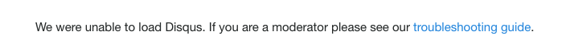
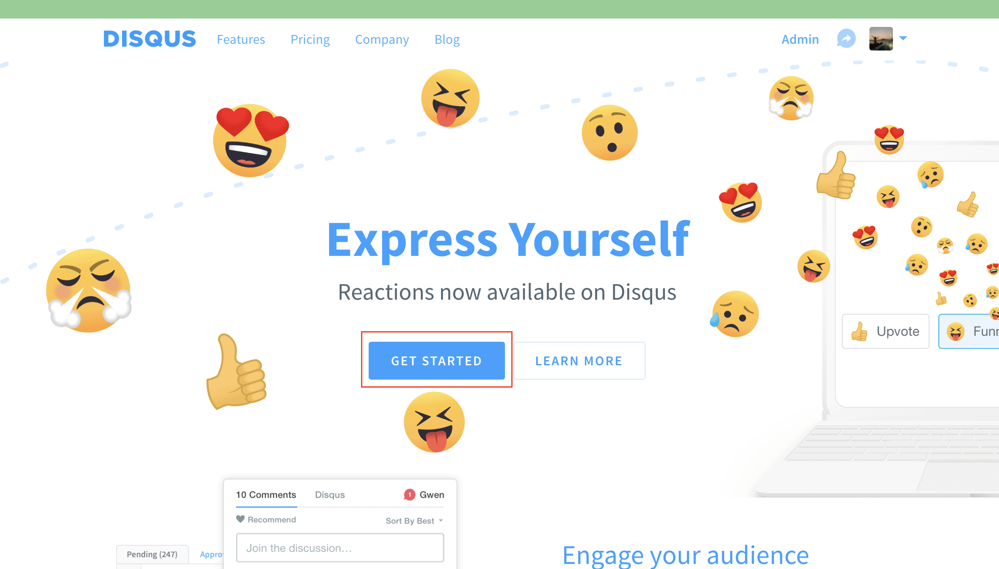
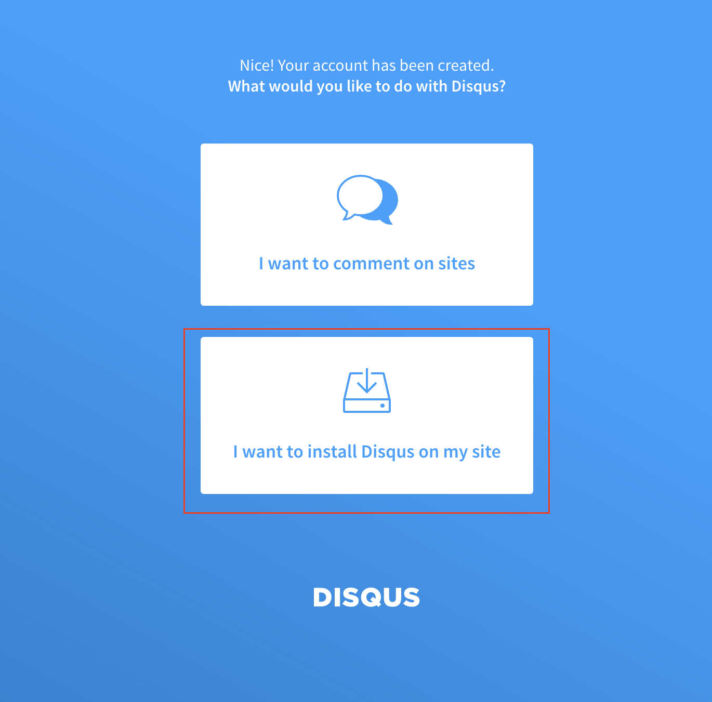
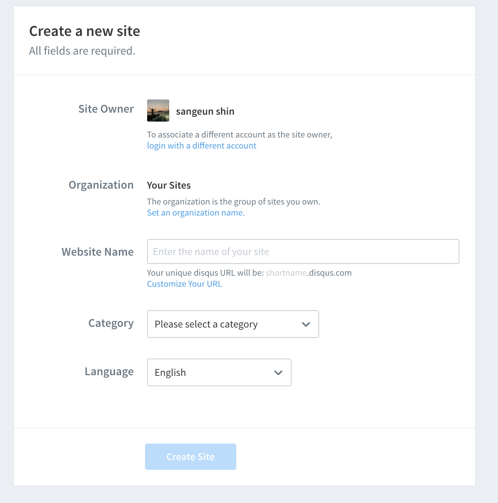
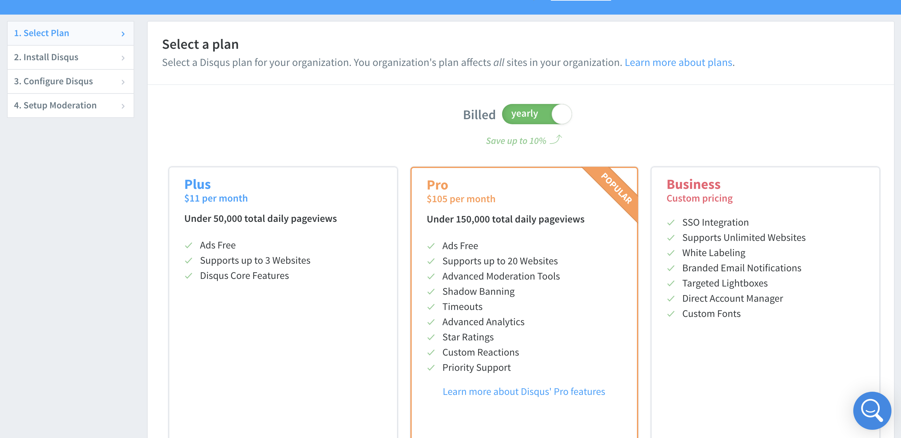
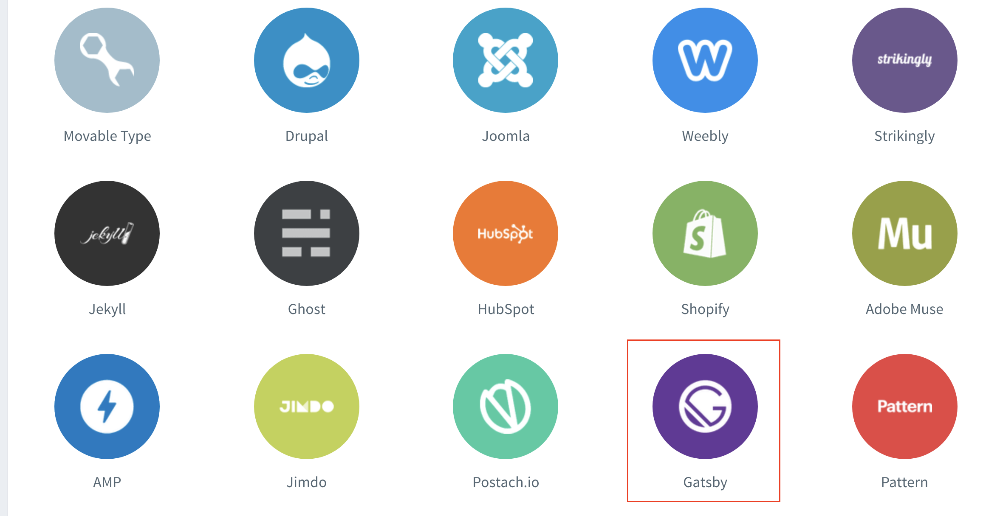
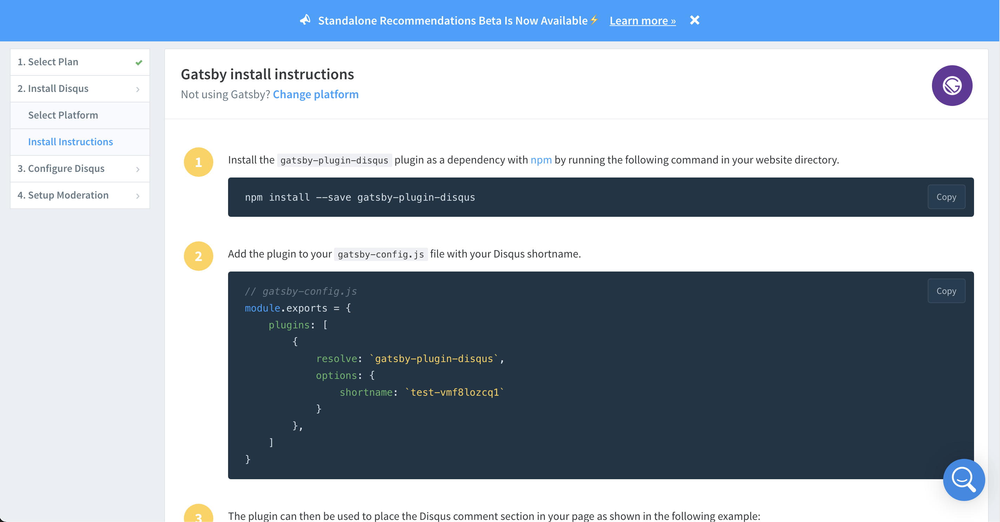
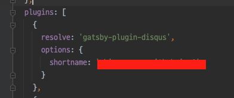
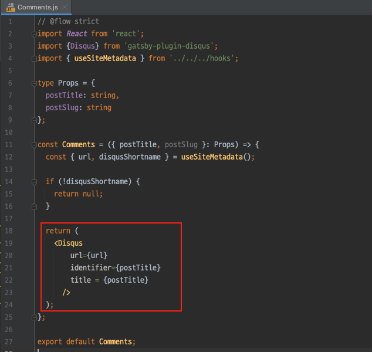
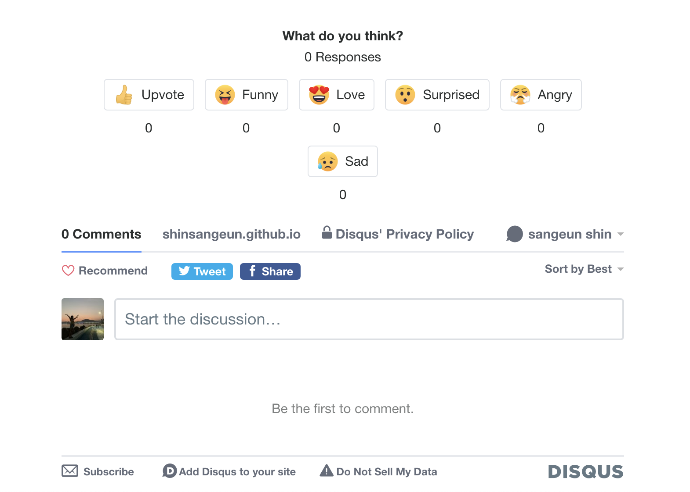

안녕하세요!

저번 포스팅에 작성 한 것 처럼 [Jekyll에서 Gatsby로 블로그를 이전](https://shinsangeun.github.io/posts/blog/gatsby-blog) 하게 되었는데,    
기존 블로그에 있던 Disqus 댓글 창이 Gatsby 에서 활성화 되지 않는 이슈가 있어서 적용하는 방법을 찾아보게 되었습니다.🤯  

그래서 이번 포스팅 에서는 **Gatsby** 블로그에 <U>**Disqus** 댓글을 추가하는 방법</U>에 대해 작성해 보겠습니다.

-----
## 1. 개요

댓글 플러그인 종류도 여러 가지 있는데 저는 가장 많이 쓰이는 `Disqus`를 선택 했습니다.  
가끔 댓글을 쓰는 분들을 위해 필요한 기능 인 것 같아서 추가하게 되었습니다.

쉽게 추가할 수 있을 줄 알았는데..  
기존 블로그에서 쓰던 Disqus라서 별 문제 없이 적용 될 거라고 생각 했던 것이 오산 이였습니다...🤐


## 2. 이슈 발생



블로그를 배포 하고 포스팅 하단을 보니 아래와 같이 문구가 적혀 있었습니다.  

```
    We were unable to load Disqus. If you are a moderator please see our trubleshooting guide.
```
오류 내용은, Disqus를 로드 하는데 문제가 생겼으니 트러블 슈팅 가이드를 참고 하라는 것 이었습니다.


## 3. 해결 방법

1. [Disqus 홈페이지](https://disqus.com/) 에 접속 합니다.


2. **Get Started** 버튼을 클릭 합니다.  

3. 블로그에 Disqus를 install 하기 위해 `하단(I want to install Disqus on my site) 버튼`을 클릭 합니다.


4. 자신의 블로그 이름, 카테고리, 언어를 설정 합니다.

   
5. 다음 화면에서 맨 하단의 Basic plan을 선택 합니다.
  
  
6. 다음 화면에서 자신의 블로그의 플랫폼을 선택합니다. 저는 Gatsby를 선택 했습니다.

   

7. 아주 친절 하게 Gatsby에 적용 하는 가이드를 알려 줍니다.



## 4. 적용
가이드에 있는 내용 대로 하나씩 적용을 해봅니다.

1. npm install 을 진행 합니다.  

2. `gatsby-config.js ` 파일에 아래 내용을 추가 합니다.


3. 기존에 있던 `Comment.js` 파일에 Disqus config를 추가 합니다.  
   (파일 경로: src/components/Posts/Comments/Comment.js)


4. 추가 하고 다시 빌드를 하면 포스팅 하단에 disqus 댓글이 추가된 것을 확인 할 수 있습니다.



## 5. 마치며
- Disqus 플러그인을 Gatsby 블로그에 적용 하는 방법에 대해 정리해 보았습니다.
- 저와 같은 이슈를 겪은 분들에게 도움이 되었으면 좋겠습니다!👍🏻

-----

오늘 준비한 내용은 여기까지 입니다.  
이번 포스팅이 도움이 되셨거나 궁금한 점이 있으시다면 언제든지 댓글을 달아주세요!🤖✨