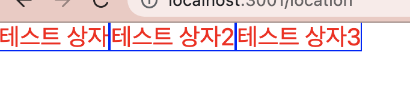
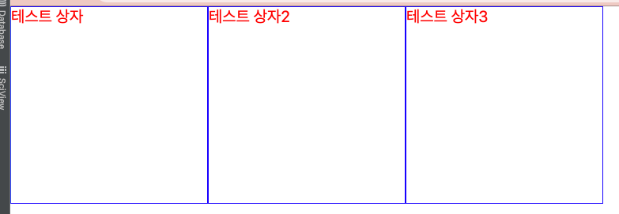
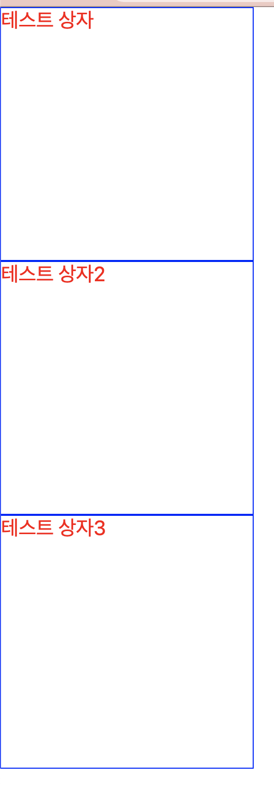
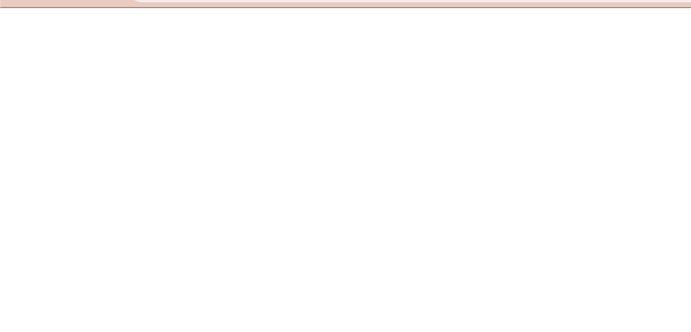

안녕하세요!

요즘 프론트엔드 개발을 하다 보니까 style을 적용 하기 위해서는 css가 필수 더라구요.  
찾아본 것도 까먹거나 헷갈린 적이 있어서...🥲  

이번 포스팅을 통해  css의 **display 속성과 종류**에 대해 알아 보겠습니다.

-----
## 1. 개요
- 제가 React.js 에서 style을 적용할 때는, 주로 `styled-components`를 사용합니다.
- 사람 마다 css 적용 방법이 달라서 어떤 분은 `scss`, `@emotion`, 아니면 기존의 css 파일을 쓰는 경우도 있다고 하더라구요. 개인 취향의 차이 이니, 각자의 스타일에 맞게 적용하시면 될 것 같아요!
- 이번 포스팅 에서는 css의 여러 요소 중 에서도 display의 종류에 대해 알아보겠습니다.


## 2. display의 종류
(1) inline   
(2) inline-block  
(3) block  
(4) none  
- display의 종류는 총 4가지 입니다. 아래의 예제를 통해 각각의 특징에 대해 알아보겠습니다.


## 3. styled-components 적용 예제
실제로 **styled-components** 를 사용 해서 react.js에 css를 적용 하는 예제를 보여 드리겠습니다.

(1) display: **inline** 일 경우,
```
   import styled from 'styled-components'

    const Test = styled.div`
        display: inline;
        height: 500px;
        width: 500px;
        color: red;
        font-size: 20px;
        border: 1px solid blue;
    `
    
    const Test2 = styled.div`
        display: inline;
        height: 500px;
        width: 500px;
        color: red;
        font-size: 20px;
        border: 1px solid blue;
    `
    const Test3 = styled.div`
        display: inline;
        height: 500px;
        width: 500px;
        color: red;
        font-size: 20px;
        border: 1px solid blue;
    `
    
    const location = () => {
        return(
            <>
                <Test>
                    테스트 상자
                </Test>
                <Test2>
                    테스트 상자2
                </Test2>
                <Test3>
                    테스트 상자3
                </Test3>
    
            </>
        )
    }
```


- 이렇게 **가로**로 3개의 테스트 상자가 만들어 지는 것을 볼 수 있습니다. 하지만 `height: 500px;, width: 500px;` 라고 크기를 지정 하였음에도 불구하고 width가 100%가 되게 합니다. 가로 한 줄을 다 차지 합니다.
- 따라서 `display: inline;` 요소는 <U>가로로 나열 되고, 요소의 크기는 지정이 안되는 것</U>을 알 수 있습니다.
(아래 소스 부터는 return 부분이 동일하므로 생략 합니다!)


(2) display: **inline-block** 일 경우,

```
   import styled from 'styled-components'

    const Test = styled.div`
        display: inline-block;
        height: 250px;
        width: 250px;
        color: red;
        font-size: 20px;
        border: 1px solid blue;
    `

    const Test2 = styled.div`
        display: inline-block;
        height: 250px;
        width: 250px;
        color: red;
        font-size: 20px;
        border: 1px solid blue;
    `
    const Test3 = styled.div`
        display: inline-block;
        height: 250px;
        width: 250px;
        color: red;
        font-size: 20px;
        border: 1px solid blue;
    `
```

- 이렇게 **가로**로 3개의 테스트 상자가 만들어 지는 것을 볼 수 있습니다. 지정된 크기 `height: 250px;, width: 250px;` 대로 박스가 나타납니다.
- 따라서 `display: inline-block;` 요소는 <U>가로로 나열 되고, 요소의 크기는 지정이 된다는 것</U>을 알 수 있습니다.


(3) display: **block** 일 경우,

```
   import styled from 'styled-components'

    const Test = styled.div`
        display: block;
        height: 250px;
        width: 250px;
        color: red;
        font-size: 20px;
        border: 1px solid blue;
    `

    const Test2 = styled.div`
        display: block;
        height: 250px;
        width: 250px;
        color: red;
        font-size: 20px;
        border: 1px solid blue;
    `
    const Test3 = styled.div`
        display: block;
        height: 250px;
        width: 250px;
        color: red;
        font-size: 20px;
        border: 1px solid blue;
    `
```

- 이번에는 **세로**로 3개의 테스트 상자가 만들어 지는 것을 볼 수 있습니다. 지정된 크기 `height: 250px;, width: 250px;` 대로 박스가 나타납니다.
- 따라서 `display: block;` 요소는 <U>세로로 나열 되고, 요소의 크기는 지정이 된다는 것</U>을 알 수 있습니다.


(4) display: **none** 일 경우,
```
   import styled from 'styled-components'

    const Test = styled.div`
        display: none;
        height: 250px;
        width: 250px;
        color: red;
        font-size: 20px;
        border: 1px solid blue;
    `

    const Test2 = styled.div`
        display: none;
        height: 250px;
        width: 250px;
        color: red;
        font-size: 20px;
        border: 1px solid blue;
    `
    const Test3 = styled.div`
        display: none;
        height: 250px;
        width: 250px;
        color: red;
        font-size: 20px;
        border: 1px solid blue;
    `
```

- 이번에는 이름에서 느껴지는 것 처럼 화면에 아무것도 나타나지 않는 것을 확인 할 수 있습니다.
- 따라서 `display: none;` 요소는 <U>화면 에서 나타나지 않고 크기 자체도 차지 하지 않는 것</U>을 알 수 있습니다.


## 4. 마치며
- css display 가 헷갈리는 분들에게 도움이 되는 포스팅 이였으면 좋겠습니다.
- 요소들과 문법을 정리 해 놓으니 이번엔 안 까먹겠죠..?👍🏻 다른 css 요소들도 포스팅에 하나씩 정리해 보도록 할께요!

-----

오늘 준비한 내용은 여기까지 입니다. 읽어 주셔서 감사합니다!

이번 포스팅이 도움이 되셨으면 아래 **좋아요** 버튼과,  
궁금한 점이 있으시다면 언제든지 **댓글**을 달아주세요!🤖✨