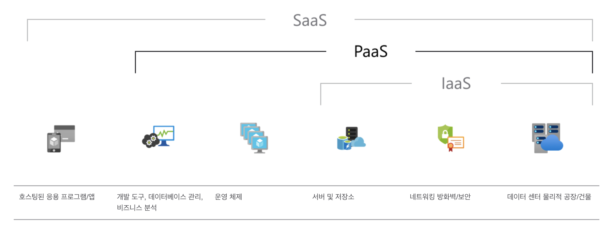

안녕하세요!

이번 포스팅 에서는 **Heroku**란 무엇 인지, Github Repository에 있는 `Node.js` 프로젝트를 배포 하는 방법에 대해 알아 보도록 하겠습니다!👩🏻‍💻


---
## 1. 개요
- 여러분!!!( ்́ꇴ ்̀)♡ 제가 토이 프로젝트들에 대해 개발을 하면서 한번도 배포를 해본 적이 없었는데, 이번에 배포를 **성공** 하게 되었습니다!! 
- 사실은 요즘 잘 나가는 AWS로 프로젝트를 배포 해 보고 싶었는데, 셋팅 까지 다 하고 배포만 남겨둔 상태였는데.. 계속 에러가 나는 바람에 배포를 성공 하지 못 했습니다.🥲
- 그러던 중에 무료로 호스팅이 가능한 **Netlify**를 알게되어, 이 사이트에서도 셋팅을 다하고 즐거운 마음으로 포스팅까지 하려고 자료 정리를 해 놓았 는데 설정 문제 인지 또 배포를 성공하지 못했었습니다.🥲
- 체념을 하고 새로운 마음으로 다른 작업을 해야지 하던 와중에, **Heroku**라는 아주 멋지고 소중한 무료 호스팅 사이트를 알게 되었습니다. 어차피 또 실패 할 것 같아서 마음을 비우고 차분히 개발 블로그를 보며 따라해 보았는데...웬걸?! 한번에 바로 배포 성공을 하게 되었습니다. (무∼야호∼!!!😝)
- 저처럼 배포에 어려움을 겪고 계시는 분이 있다면 이 포스팅을 참고 해주세요!!😊

## 2. Heroku 란?
- **헤로쿠(Heroku)** 란, 웹 애플리케이션 배치 모델로 사용되는 여러 프로그래밍 언어를 지원하는 `클라우드 PaaS` 입니다. Git과 Github등을 지원하고, 많은 서비스를 애드온과 API로 지원 합니다.
- 지원 하는 프로그래밍 언어
```
    1. Node.js
    2. Ruby
    3. Java
    4. PHP
    5. Python
    6. Go
    7. Scala
    8. Clojure
```
- 출처: [👉🏻나무 위키](https://namu.wiki/w/Heroku)

- 쉽게 말해서 **AWS**, **Netlify**와 같은 역할을 하는 무료 호스팅 서비스 클라우드 라고 생각하시면 됩니다. 물론, **AWS**는 <U>1년 동안만 무료로 사용</U>할 수 있고 **Netlify**와 **Heroku**는 <U>무료로 사용</U>할 수 있는 차이점이 있습니다.
- 저는 많은 유저가 사용하는 서비스가 아니고 배포 테스트 용도로 사용하다 보니, 무료 호스팅 서비스를 찾게 되었고 그 중에서 **Heroku**를 선택하게 되었습니다. 본인의 프로젝트와 사용 용도에 따라 적절한 사이트를 골라서 사용하시는 것이 좋을 것 같습니다!


### 2-1. 클라우드 PaaS 란?
- `PaaS(Platform as a Service)`는 단순한 클라우드 기반 앱에서 정교한 클라우드 사용에 이르기까지 <U>모든 것을 제공할 수 있는 리소스가 포함되어 있으며 클라우드에서 제공되는 완전한 개발 및 배포 환경</U>입니다.
- **PaaS**를 사용하면 소프트웨어 라이선스, 기본 애플리케이션 인프라 및 미들웨어, 컨테이너 오케스트레이터(ex. Kubernetes) 또는 <U>개발 도구와 기타 리소스를 구입하고 관리하는 비용과 복잡성이 없어집니다.</U> **사용자**는 <U>개발하는 응용 프로그램과 서비스를 관리</U>하고 **클라우드 서비스 공급자**는 <U>일반적으로 그 밖의 모든 항목을 관리</U>합니다.

- 출처: [👉🏻Microsoft azure](https://azure.microsoft.com/ko-kr/overview/what-is-paas/)


## 3. Heroku 가입
1. Heroku를 시작 하기 위해서 [👉🏻 heroku 공식 홈페이지](https://id.heroku.com/login) 에 접속 합니다.

2. Heroku에 회원 가입을 합니다.


3. 회원 가입 이후에는 이메일 계정으로 인증 메일이 옵니다.


4. 메일에 있는 링크로 접속한 후 작업을 시작 합니다.

 
## 4. Heroku 배포 방법
1. 위에서 링크로 접속 한 다음에 배포하는 방법 입니다. 상단의 **New** 버튼을 누르고 **Create new app** 버튼을 선택 합니다.


2. 자신이 배포할 App Name을 입력하고, region을 선택 합니다. (United States, Europe이 있는데 저는 기본값인 United States로 설정 하였습니다.)


3. 배포 방법(Deploy method)에 Heroku git, Github, Container Registry 중에서 선택 합니다.  
(저는 Github에 있는 Repository를 배포할 거라서 Github를 선택 하였습니다.)


4. Github를 선택하면 자신의 Github 계정이 나타나고 연결할 `Repository`를 검색하는 버튼이 나타납니다. 배포할 레포지토리를 선택합니다. 


5. 레포지토리를 선택하면 하단에 `Automatic deploys`, `Manual deploy` 창이 나타납니다. 배포할 브랜치도 설정 해 줄수 있습니다. `Enable Automatic Deploys` 버튼을 클릭하면, 선택한 브랜치가 자동으로 배포 되도록 합니다.  
(저는 Enable을 클릭하여 활성화 시켜주었습니다.)


6. 배포할 브랜치를 선택하고, 오른쪽에 있는 `Deploy Branch` 버튼을 누르면 배포가 시작 됩니다. 하단에 실행중인 `배포 로그`가 나타납니다.


7. 배포가 성공 하였으면 아래와 같이 나타납니다. `View` 버튼을 눌러 배포 사이트를 확인 합니다.


8. 배포가 실패 하였으면 아래와 같이 나타납니다. 배포가 실패 하면 자신의 이메일로 메일이 수신됩니다.


## 5. Heroku 배포 확인
- 이전에 작성한 포스팅인 [👉🏻[Project] NailOllae - 개발 항목 정리](https://shinsangeun.github.io/posts/toyProject/nailollae-2) 를 **Node.js** 로 만들어서 **Heroku**에 배포를 해 보았습니다.
- [👉🏻 네일 올래? 배포 사이트](https://nailollae.herokuapp.com/) 가 성공적으로 배포 되었습니다!


- 무료 사이트 이다보니 사용할 때 약간 delay가 있지만 가볍게 사용 하기에는 무리가 없어 보입니다. 개발자 포트폴리오나 가벼운 토이 프로젝트를 배포하기에 아주 유용하게 쓰일 듯 합니다.👍🏻


## 6. 마치며
- 배포를 성공 하자마자 바로 포스팅을 작성하게 되어 부족한 부분이 있을 수 있지만, 제가 만든 토이 프로젝트를 처음으로 사이트에 배포하게 되어 너무 뿌듯합니다.🤩
- 이 포스팅을 보고 **Heroku** 에서 여러분들의 포트폴리오나 토이 프로젝트를 배포에 성공 하셨으면 좋겠습니다!


-----

오늘 준비한 내용은 여기까지 입니다.  
이번 포스팅이 도움이 되셨거나 궁금한 점이 있으시다면 언제든지 댓글을 달아주세요!👩🏻‍💻💕


