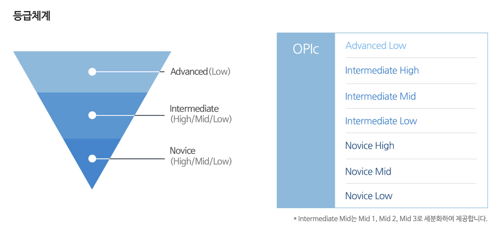

안녕하세요!

이번 포스팅에서는 `오픽(OPIc)` 시험을 준비 하기 위한 과정과 독학으로 준비하는 방법에 대해 소개해 드리 고자 합니다.🐮  
새해를 맞이해서 빼 놓을 수 없는 목표 한가지!  
바로, **⭐️영어⭐️** 라고 할 수 있는데요.  

성장 하기 위한 **2021년**을 보내기 위해 [👉🏻알고리즘 강의](https://shinsangeun.github.io/posts/algorithm/online-lecture) 에 이어서 영어 오픽 시험을 준비해 보려고 합니다.


## 1. 오픽(OPIc) 이란?
- **오픽(OPIc)** 은 `공인인증 영어 말하기 시험` 입니다. 
- 컴퓨터를 이용해 응시자 개개인의 질문에 대한 **대답을 녹음**한 후 미국의 평가 서버에 전송 하여 **공인 평가자가 평가** 합니다.
- 오픽은 토익의 점수와 달리 등급으로 평가가 되는데요, 저도 오픽은 처음 공부 하다보니 등급에 대해 잘 몰라서 찾아 보았습니다. 
- `Advanced Low`이 높은 등급이고, `Novice Low`가 가장 낮은 등급 입니다. 보통 취업 준비를 위해서 `AL` 이나 `IH` 등급을 목표로 설정 한다고 합니다.

- 출처: [👉🏻오픽 홈페이지](https://m.opic.or.kr/opics/jsp/senior/receipt/aboutOpicMobile.jsp)


## 2. 오픽(OPIc)을 선택한 이유
- 아무래도 취업을 준비 하다 보니 이력서에 **공인 영어 점수**가 있으면 좋지 않을까 생각을 했었습니다.
- 이전 에는 해외 출장도 많이 다니고 해외 여행도 자주 갔던 편이라, 일상적인 대화는 무리 없이 하는 편인데 이걸 이력서에 쓰자니...영어 공인 점수가 필요할 것 같아서 여러 종류의 영어 시험 중에 오픽에 도전하게 되었습니다.
- 맨 처음 취업 할 때는 토익 시험을 준비 했었는데, 토익은 `LC&RC`를 모두 준비 해야하는 시험이고 단기간에 점수를 올리기에는 난이도가 있는 편이었습니다.
- 하지만 오픽은 **단기간**에 등급을 올릴 수 있고, 자신이 **대화 주제를 정해서** 그에 맞는 주제에 대한 **질문이 15개**로 출제되고, 제한 시간내에 대답을 잘 말하면 좋은 등급이 나올 수 있는 시험입니다.
- 그래서 주저 없이 영어 공인 시험을 **오픽**으로 선택하게 되었습니다.


## 3. 오픽(OPIc) 준비
- 오픽 준비는 처음이라 정보가 많이 없어서 오픽 선배님들의 여러 블로그와 유투브를 통해 정보를 접하게 되었습니다.
- 영어 시험으로 유명한 영어 학원(`파고다`, `해커스` 등등..)은 코로나 때문에도 위험하고, 학원비도 비싸서 **독학**으로 한번 해 보는게 어떨까 하여 독학 준비 방법을 알아 보았습니다.

### 3-1. 유투브 추천
- 유투브 중에 가장 유명한 오픽 채널은 [👉🏻오픽노잼](https://www.youtube.com/c/opicnojam) 이었습니다.
- `영어의 0도 모르면 1로와!`로 시작하는 오픽 노잼 채널에서는 **IH-AL** 등급을 받기 위한 콘텐츠가 많이 있습니다. 또한 영상도 많고 설명을 재밌게 해 주셔서 이해가 쉬웠습니다. 
- 마냥 스크립트를 외워서 말하는 방식 보다는 자신에 대한 이야기를 자연스럽게 대화하는게 좋다고 알려주는 채널 입니다.
- 저도 오픽을 처음 공부 하기 때문에 `스크립트를 외워야 하나` 생각 했었는데 **오픽노잼** 영상을 보고 스크립트 말고 **진실성 있고 자연스럽게** 말하는 것이 중요 하다고 생각이 들었습니다.
- 요즘도 매일 영상을 보며 혼자 말하기 연습을 합니다..🗣

### 3-2. 책 추천
- 오픽을 준비할 때 책이 있어야 할 것 같아서 가장 후기가 많은 책으로 골라보았습니다.
- 바로 이 책 [👉🏻2주만에 끝내는 해커스 오픽 OPIc](https://book.naver.com/bookdb/book_detail.nhn?bid=10786609) 입니다. 실제로 2주만에 오픽을 빨리 끝내고 싶기도 했고..후기를 보니 이 책으로 공부한 분들이 많더라구요.
- 지난주에 책을 주문 해서 오늘 부터 책을 공부해 보려고 합니다! 아직 시작은 하지 않아서..추후에 책에 대한 리뷰도 정리해 보겠습니다.🤓


### 3-3. 미드 추천
- 미드 쉐도잉을 통해 영어 스피킹을 공부 했다는 분들도 많이 계시더라구요. 반복해서 보고 발음을 따라 하다보면 어느새 원어민 처럼 발음하고 있는 자신을 발견하게 될 지도 모른답니다..🤷🏻‍♀️
- **넷플릭스**에 있는 아래의 드라마가 영어 공부로 유명하더라구요. 넷플릭스를 즐겨보는 사람으로써 미드를 통해 영어 공부를 하면 **1석 2조**가 아닐까 생각합니다.
```
1. 모던 패밀리
2. 굿 플레이스
3. 프렌즈
4. 빅뱅이론
5. 가십걸
```
- 저는 미드를 보지는 않았지만 영어 공부할 시간이 많거나 딱딱한 영어 공부가 하기 싫은 때에는 미드를 보면서 영어 공부를 하면 좋을 것 같습니다!


## 4. 시험 접수
- 오픽 시험 접수는 이 곳 [👉🏻오픽 홈페이지](https://book.naver.com/bookdb/book_detail.nhn?bid=10786609) 에서 할 수 있습니다.
- 회원 가입을 하고 `센터별/날짜별` 선택을 통해 시험을 접수 합니다.
- 시험 센터는 전국에 여러 곳이 있는데 보통 자신의 집 주변 이나 아니면 시설이 좋은 곳에 가고 싶으면 자신의 취향에 맞게 선택 하시면 됩니다.
- 영어 공부를 미루면 공부를 안할 것 같아서, 저는 2주 뒤에 **대학로**에 있는 **공인인증 센터**로 시험을 접수 하였습니다!
- 처음 보는 오픽 시험이라 너무 떨리지만 시험 접수를 하면 공부를 더 열심히 할 수 있을 것 같아서(?) 당.장. 접수를 하였습니다.😄
- 참고로, 2021년 기준 응시료는 **78,100원(부가세 포함)** 입니다. 학생이나 취준생에게는 응시료가 비싸기 때문에 시험을 자주 보지는 못할 것 같습니다..🥲


## 5. 마치며
- 새해 부터 아주 정신 없이 바쁜 나날 들을 보내고 있는데요, 자기 발전을 위해서 쓰는 돈은 아깝지 않은 것 같습니다.
- 2주 뒤에 보는 오픽 시험 후기도 포스팅을 준비해 보도록 하겠습니다!
- 오픽을 준비 하시는 분들이 있다면, 모두들 높은 등급을 받을 수 있도록 바라며 포스팅을 마치겠습니다.(•ө•)♡


-----

오늘 준비한 내용은 여기까지 입니다.  
이번 포스팅이 도움이 되셨거나 궁금한 점이 있으시다면 언제든지 댓글을 달아주세요!🙋🏻‍♀️✨   
