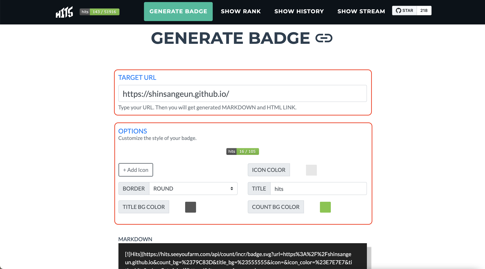
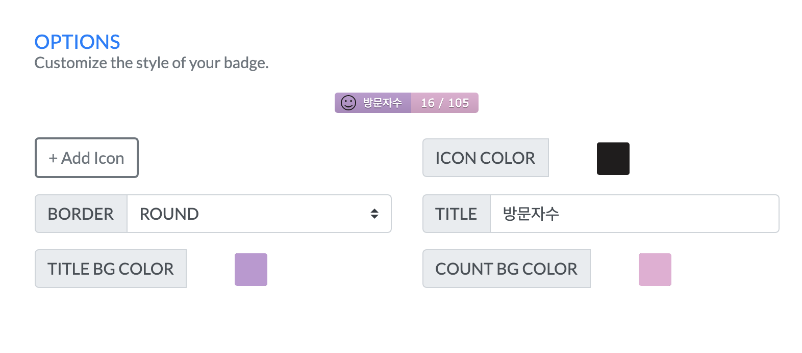
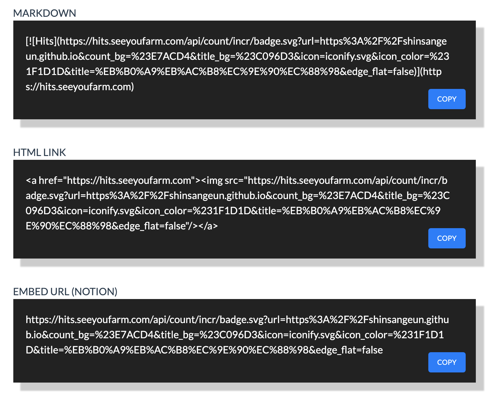
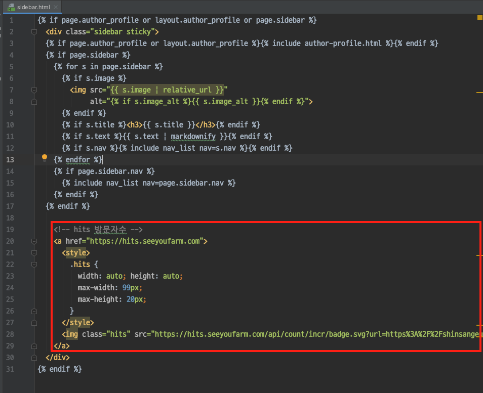
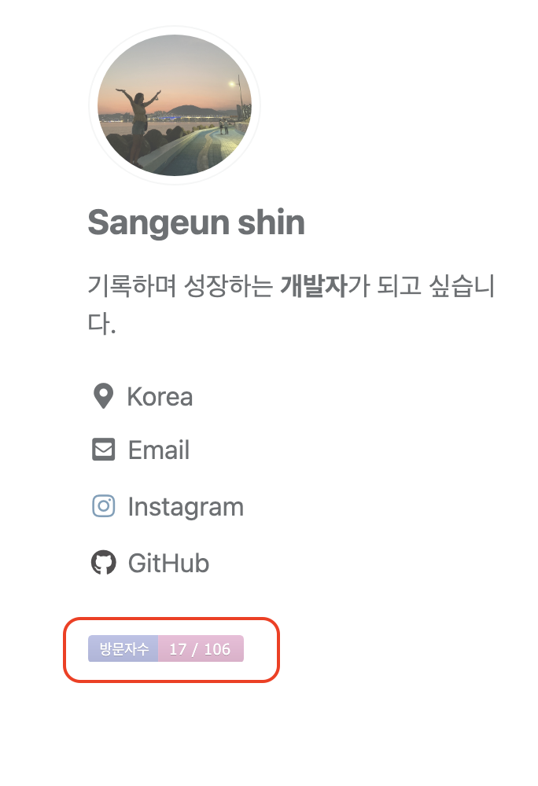

안녕하세요!

이번 포스팅에서는 제 블로그 왼쪽 사이드 바 하단에 있는 방문자 수를 확인 하는 `Hits`에 대해 작성해 보도록 하겠습니다!

-----
## 1. 개요
- `티스토리 블로그`, `네이버 블로그` 등 여러 블로그 사이트에서는 전체 방문자수와 일별 방문자수를 확인 할 수 있는 UI가 있습니다. 
- 하지만 Github Blog에는 이러한 정보를 확인 할 수 있는 메뉴가 없더라구요. 그래서 찾아본 것 중에 [👉🏻Github 프로필을 꾸밀 때](https://shinsangeun.github.io/categories/Github/github-profile) 사용했던 Hits를 블로그에 적용 시켜보고자 시작하게 되었습니다.
- 사실 Hits가 새로고침 할 때마다 숫자가 올라가는 거라 정확한 방문자 수는 아닐 수 있지만, 깔끔하고 제가 찾은 것 중에는 이 방법이 좋을 것 같아서 선택하게 되었습니다.

## 2. Hits 생성하기
- [👉🏻Hits 사이트](https://hits.seeyoufarm.com)에 들어가서 방문자 수를 추적하기 위한 작업을 합니다.

- `TARGET URL`에 자신이 추적할 URL을 입력 합니다.
- `OPTIONS`에는 hits 아이콘 모양, 색깔, TITLE을 변경 할 수 있습니다.

- 저는 이런 식으로 커스텀을 하여 수정 하였습니다. 지금 보니 TITLE 옆에 귀여운 Icon을 추가 할 수도 있네요!😊

- 자신만의 아이콘을 만들고 나면 아래에 `MARKDOWN`, `HTML LINK`, `EMBED URL` 각각의 형태로 소스 코드가 수정 됩니다. 이 중에서 자신이 원하는 타입의 코드를 복사해서 붙여넣기 해주면 됩니다!
- Github 프로필을 꾸밀 때는 markdown 코드를 사용 했지만, 이번에는 Github 블로그에 적용을 시켜야 하므로 `HTML LINK`를 복사해 옵니다!
 

## 3. Jekyll Blog에 추가 하기
- 위에서 복사한 코드를 자신의 블로그에 붙여넣기 해야 합니다. Hits 방문자 수를 추적하기 위해 메인 페이지에 코드를 붙여 넣었습니다.
- 본인이 아이콘을 넣고 싶은 위치에 선택해서 붙여 넣으시면 됩니다. 저는 왼쪽 사이드바 하단에 아이콘을 추가하려고 합니다.

1. `/_includes/sidebar.html` 파일을 엽니다.
 
2. 아까 복사해온 코드를 맨 아래쪽에 붙여넣기 합니다.

- 여기에서 `<style>` 태그를 추가한 이유는, 처음에  태그만 복사해서 붙여넣기 했더니 sidebar에 전체 아이콘 크기가 가득 차더라구요.
- 그래서 `<style>` 태그에 `max-width`, `max-height`를 hits 아이콘 사이즈를 조절해 주는 코드를 추가해 주었습니다.
- 사실 계속 사이드바에 맞게 아이콘이 크게 보여서 이 부분에서 삽질을 많이 했습니다..🥲 그래서 저와 같은 문제가 있는 분들에게 도움이 되셨으면 좋겠습니다!

3. Github에 Push하고 블로그를 확인 합니다.

- 짜잔!✨ 기존의 Hits 아이콘 크기처럼 작고 예쁘게 사이드바에 나온것을 확인할 수 있습니다. 이렇게나마 자신의 Github 블로그 방문자 수를 확인 할 수 있어서 좋은 것 같아요!👍🏻 

## 4. 마치며
- 포스팅 별 Hits도 추가해 놓았는데, Hits의 특정 이슈(?) 때문에 제대로 동작하지 않는다고 해요. 속상하던 찰나에 이렇게라도 전체 방문자수를 확인 할 수 있어서 아주 유용한 것 같습니다!
- 다음 포스팅 에는 Jekyll 블로그에 `검색 기능`을 추가하는 내용으로 돌아오겠습니다! 

-----

오늘 준비한 내용은 여기까지 입니다.  
이번 포스팅이 도움이 되셨거나 궁금한 점이 있으시다면 언제든지 댓글을 달아주세요!🤖✨