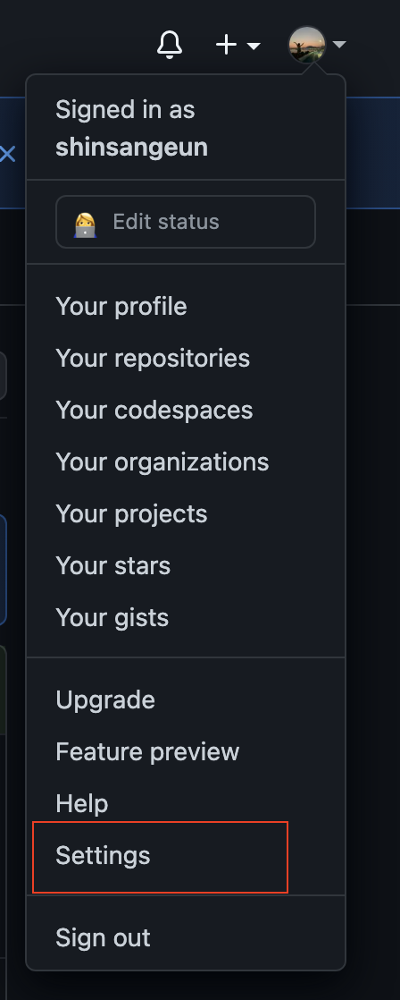
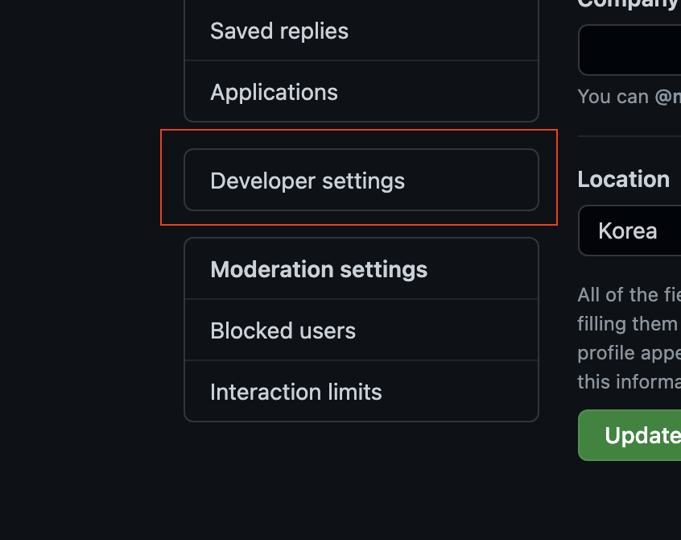
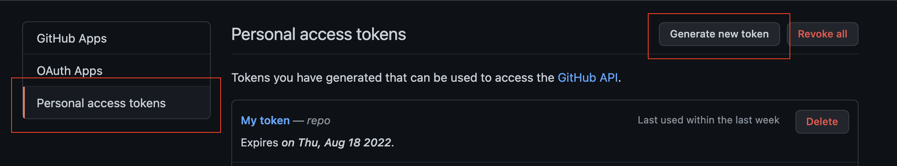
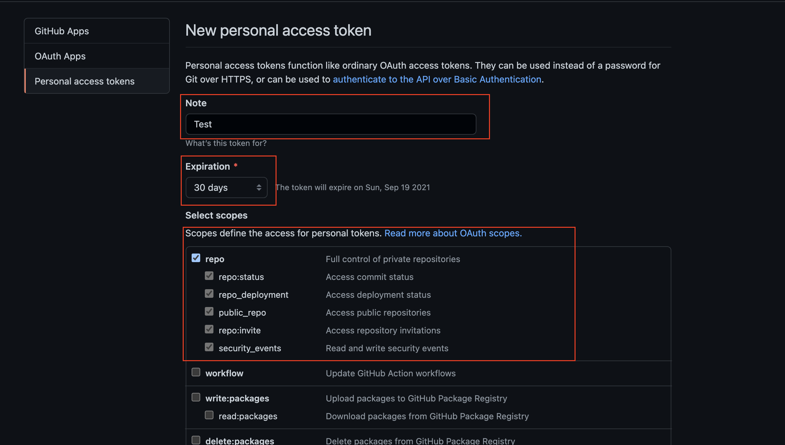
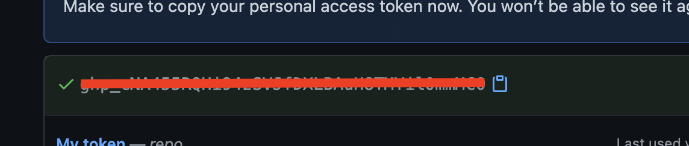
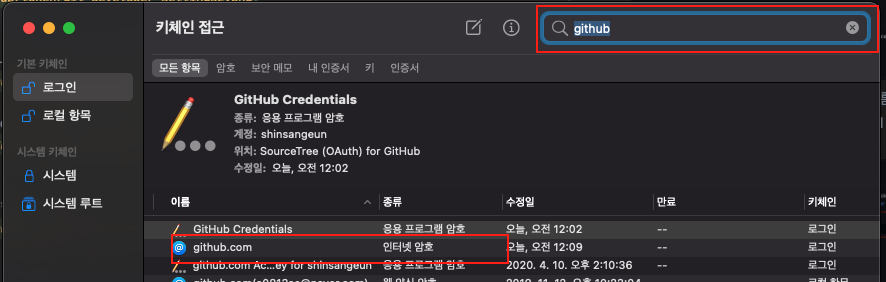
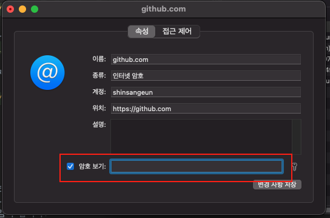

안녕하세요!

이번 포스팅 에서는 Github에서 **Authentication Token 발급**과,  
발급한 토큰을 **Mac OS 환경에서 적용하는 방법**을 알아보겠습니다.👨‍🏫

-----
# 1. Github 배포 이슈
블로그를 수정하고 Deploy 하는 과정에서 자꾸 배포 에러가 발생해서 구글링을 하게 되었습니다.

```
  remote: Support for password authentication was removed on August 13, 2021. Please use a personal access token instead. remote: Please see https://github.blog/2020-12-15-token-authentication-requirements-for-git-operations/ for more information. fatal: unable to access 'https://github.com/shinsangeun/shinsangeun.github.io.git/': The requested URL returned error: 403
```

이러한 에러가 뜨면서 배포가 제대로 실행 되지 않았습니다.  
그런데 에러 내용을 살펴 보니, `2021년 8월 13일` 부터 Github의 토큰으로 비밀번호 인증이 되어야 한다고 하네요.  (엥?..제 생일 이예요!🥳)

그래서 부랴부랴 해결 방법을 찾게 되었습니다!


# 2. Github Token 발급 방법
Github에서 토큰을 발급 하는 방법 입니다.

1. 자신의 Github에 로그인 합니다.
   
2. 상단의 **Profile > Settings** 버튼을 클릭 합니다.
   
   
3. 왼쪽 하단에 **Developer Settings** 버튼을 클릭합니다.
   
   
4. 왼쪽에 세번째 버튼 **Personal access tokens** 버튼을 클릭하고, 새로운 토큰을 생성하기 위해 **Generate new token** 버튼을 클릭 합니다.
   

4. 상단의 **Note**에는 자신이 설정할 토큰의 이름, **Expiration**은 토큰 만료일을 설정 합니다. (저 같은 경우는 만료일을 1년으로 설정 했어요.)  
   Select scopes 에서는 **repo** 를 전체 체크 합니다.
   

5. 4번의 과정이 모두 끝나면 하단의 **Generate token** 버튼을 눌러서 토큰을 발급 합니다.
    

6. 발급된 토큰을 **꼭! 저장해 놓아야 합니다.**  
   새로고침 하면 안 보이기 때문에 다시 발급 해야 합니다.
   


# 3. Mac OS 적용 방법
2번까지의 과정을 모두 거쳐 토큰을 발급 하였습니다.  
`Mac OS` 환경에서 적용 하는 방법 입니다.

1. **키체인 접근**을 엽니다. (Spotlight에서 검색 합니다: `command + space bar`)
   
2. 상단에 **github**를 검색 합니다.
   github에 저장된 자신의 로그인 정보가 나타납니다. 이중에서 **github.com, 인터넷 암호**를 더블 클릭 합니다.
   
   
3. 여기에서 하단의 암호보기를 체크 한 후, 아까 위에서 **발급 받았던 토큰**을 붙여 넣기 합니다.
    
   
4. **변경 사항 저장** 버튼을 누르고 적용한 이후에, 다시 배포를 실행하면 정상적으로 동작 하는 것을 확인 할 수 있습니다.


# 4. 마치며
Github의 보안 강화 를 위해 토큰으로 로그인 하는 방식이 추가 된것 같아요!  
평소에 잘 사용 하던 Github Blog가 Deploy가 안되서 당황스러웠는데, 최근에 이렇게 바뀌었는데 금방 알게 되어서 다행이네요.

토큰 발급 까지는 금방 했는데 Mac에서 키체인에서 적용 방법을 몰라서 급하게 정리해 보았습니다..🤯  
다른 분들에게도 많은 도움이 되는 포스팅이였으면 좋겠습니다~!

-----

오늘 준비한 내용은 여기까지 입니다.  
이번 포스팅이 도움이 되셨거나 궁금한 점이 있으시다면, **추천 &댓글** 부탁드려요!😎👍🏻