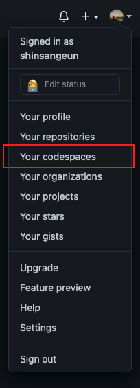
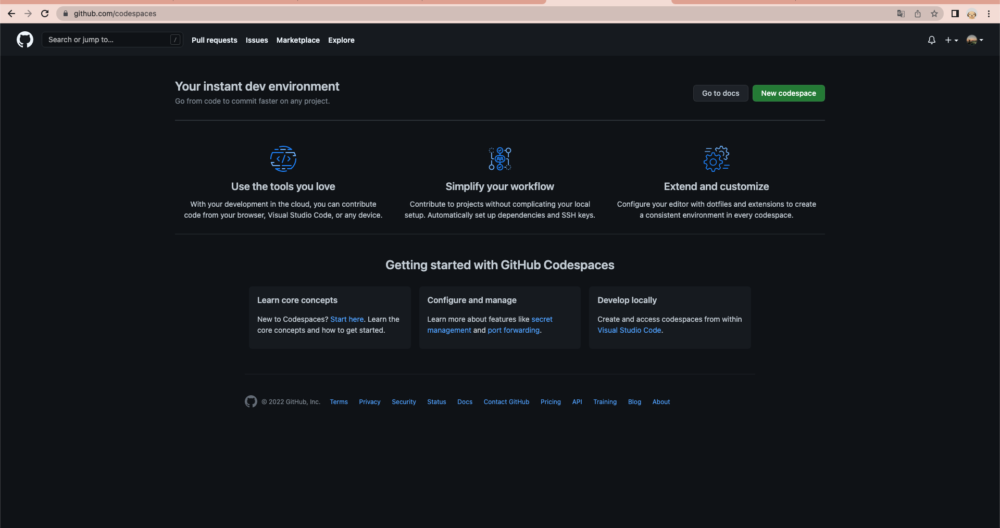
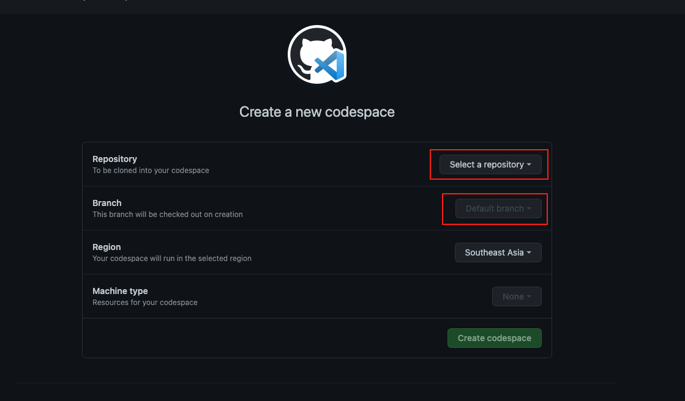
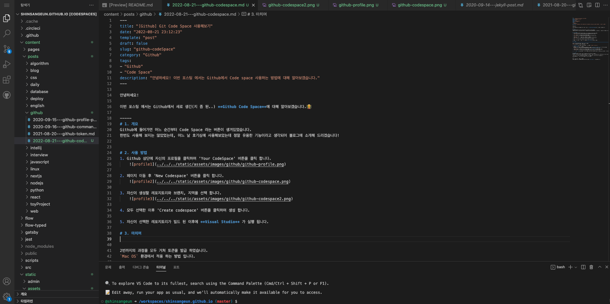

안녕하세요!

이번 포스팅 에서는 Github에서 새로 생긴(지 좀 된..) **Github Code Space**에 대해 알아보겠습니다.👨‍🏫

Github에 들어가면 어느 순간부터 **Code Space** 라는 버튼이 생겨있었습니다.  
최근 호기심에 잠깐 사용해보았는데, 간단하지만 정말 유용한 기능이라고 생각되어 블로그에 소개해 드리겠습니다.

-----

# 1. 사용 방법
1. Github 상단에 자신의 프로필을 클릭하여 'Your CodeSpace' 버튼을 클릭 합니다.
    

2. 페이지 이동 후 'New Codespace' 버튼을 클릭 합니다.
    

3. 자신이 생성할 레포지토리와 브랜치, 지역을 선택 합니다.
    

4. 모두 선택한 이후 'Create codespace' 버튼을 클릭하여 생성 합니다.

5. 자신이 선택한 레포지토리가 빌드 된 이후에 **Visual Studio** 가 실행 됩니다.
    

# 2. 사용 후기
사실 별거 아니라고 생각했었는데, 막상 사용해 보니 너무 너무 편하고  
개발툴을 사용하지 않고도 작업이 가능하다는게 신기하고 새로운 환경이라고 생각 합니다.

특정 브랜치를 선택 할 수도 있고 급하게 개발 할 건이 생겼을 때나 개발 툴을 사용하기 어려운 환경이라면
코드 스페이스를 아주 유용하게 사용할 수 있을 것 같아요. 커밋과 푸시도 당연히 되고, 일반 개발툴을 사용하는 느낌과 똑같아요.

예전에 개발 툴 없이 바로 개발할 수 있을 수는 없을까 하는 생각을 해본 적이 있었는데  
역시 저만 그런 생각을 하는 게 아니였나 봅니당..🤐
 
간단하고 쉽게 개발할 수 있는 code space와 함께 즐거운 코딩이 되는 포스팅이였으면 좋겠습니다~!

-----

오늘 준비한 내용은 여기까지 입니다.  
이번 포스팅이 도움이 되셨거나 궁금한 점이 있으시다면, **추천 &댓글** 부탁드려요!😎👍🏻