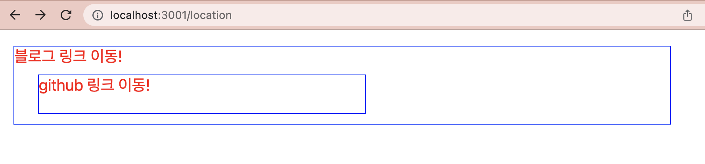
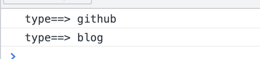
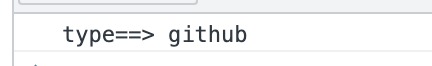

안녕하세요!

이번 포스팅 에서는 `Javascript`의 이벤트 버블링이란 무엇인지 알아보고,
`React.js`에서 사용 하는 방법에 대해 알아보도록 하겠습니다.

-----

## 1. 이벤트 버블링 소개
- 프론트 엔드 면접을 볼 때 가끔 Javascript의 이벤트 버블링에 대한 질문이 있었는데요. 그 당시에는 정확한 개념을 잘 몰랐다가 이번에 예제를 통해 사용방법을 알게 되어 작성해 보겠습니다.
- **이벤트 버블링**이란, 부모와 자식의 이벤트가 동시에 발생 할 때 겹치는 영역이 있는 경우 부모의 이벤트가 발생하는 현상 입니다.
- 아래 예제를 통해 알아보겠습니다.


## 2. React.js 사용 방법
- 화면에 컴포넌트 안에서 부모와 자식 컴포넌트가 있을 때 각각의 이벤트가 존재 한다고 가정 합니다.
- `블로그 링크 이동!`을 누르면 새창으로 블로그 링크가 열리고, `github 링크 이동!`을 누르면 새창으로 github 링크가 열리는 컴포넌트를 만들었습니다.
- 이 때 겹쳐진 영역을 클릭하면 <U>자식의 이벤트(github 링크 이동)</U>이 실행 되어야 하는데, <U>부모의 이벤트(블로그 링크 이동)</U>가 실행 됩니다.

### 2-1. 예제 코드
```
import styled from 'styled-components';

const Menu5 = styled.div`
    height: 100px;width: 80%;color: red;border: 1px solid blue;font-size: 20px;position: absolute;margin: 20px;
`;

const Menu6 = styled.div`
    height: 50px;width: 50%;color: red;font-size: 20px;border: 1px solid blue;position: relative;margin: 10px;left: 20px;
`

const handleLink = (type) => {
    console.log("type==>", type)
    if(type === "blog"){
        window.location.href = "https://shinsangeun.github.io/";
    }else{
        window.location.href = "https://github.com/shinsangeun";
    }
}

const location = () => {
    return(
        <Menu5 onClick={() => handleLink( "blog")}>
            블로그 링크 이동!
            <Menu6 onClick={() => handleLink( "github")}>
                github 링크 이동!
            </Menu6>
        </Menu5>
    )
}

export default location;
```

- 위의 코드를 실행 시키면 아래와 같은 화면이 보여집니다.

- 화면에서 겹쳐진 영역의 "github 링크 이동!" 을 클릭해보면, console 영역에 type이 github, blog 2개가 찍힙니다. 또한 페이지 링크는 블로그 링크로 연결 됩니다.

- 영역이 겹쳐져 있는 부분을 클릭 했을 때, <U>자식 컴포넌트와 부모 컴포넌트의 이벤트가 동시에 실행 되는 것</U>을 알 수 있습니다. 이러한 현상을 **이벤트 버블링** 이라고 합니다.
- 우리가 만든 handleLink를 의도한 대로 실행 시키려면 이벤트 버블링을 막아야 하는데, 이벤트 버블링을 막기 위해서는 어떻게 해야 하는지 예제 코드를 통해 알아보겠습니다.


## 3. 이벤트 버블링 막기
- 이벤트 버블링을 막기 위해서는 `event` 파라미터를 추가해 주면 됩니다.
- handleLink에 `event` 파라미터를 추가 해주고 이벤트 함수 **event.stopPropagation()** 를 추가 해 줍니다.

```
const handleLink = (event, type) => {
    event.stopPropagation();
    console.log("type==>", type)
    if(type === "blog"){
       window.location.href = "https://shinsangeun.github.io/";
    }else{
       window.location.href = "https://github.com/shinsangeun";
    }
}

const location = () => {
    return(
        <Menu5 onClick={(event) => handleLink(event, "blog")}>
            블로그 링크 이동!
            <Menu6 onClick={(event) => handleLink( event,"github")}>
                github 링크 이동!
            </Menu6>
        </Menu5>
    )
}
```

- 화면에서 겹쳐진 영역의 "github 링크 이동!" 을 클릭해보면, console 영역에 type이 github 1개만 찍힙니다. 페이지 링크는 github 링크로 연결 됩니다.

- 해당 함수는 현재 발생한 이벤트 이후의 이벤트 들을 막아주는(이벤트 전파를 막아주는) 함수 입니다. 이 함수를 추가해 주면 겹쳐진 영역을 클릭했을 때 자신의 이벤트만 실행 되게 됩니다.
- 자세한 설명은 [👉🏻mdn web docs](https://developer.mozilla.org/ko/docs/Web/API/Event/stopPropagation) 를 참고 해 주세요!

### 3. 마치며
- 여기까지 이벤트 버블링이란 무엇인지, 사용 방법에 대해 정리 해 보았습니다. 겹치는 부분이 있을 때는 어떻게 이벤트를 한번만 실행 하게 하는지 구글링을 하다가 찾게 되었는데 이벤트 버블링의 개념을 알게 되어 도움이 되었습니다.
- 내용이 도움이 되셨다면 아래 **좋아요**나 **댓글** 부탁 드립니다!👍🏻

-----

오늘 준비한 내용은 여기까지 입니다.  
이번 포스팅이 도움이 되셨거나 궁금한 점이 있으시다면 언제든지 댓글을 달아주세요!🙋🏻‍♀️✨    

