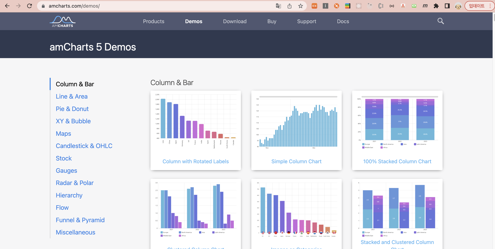
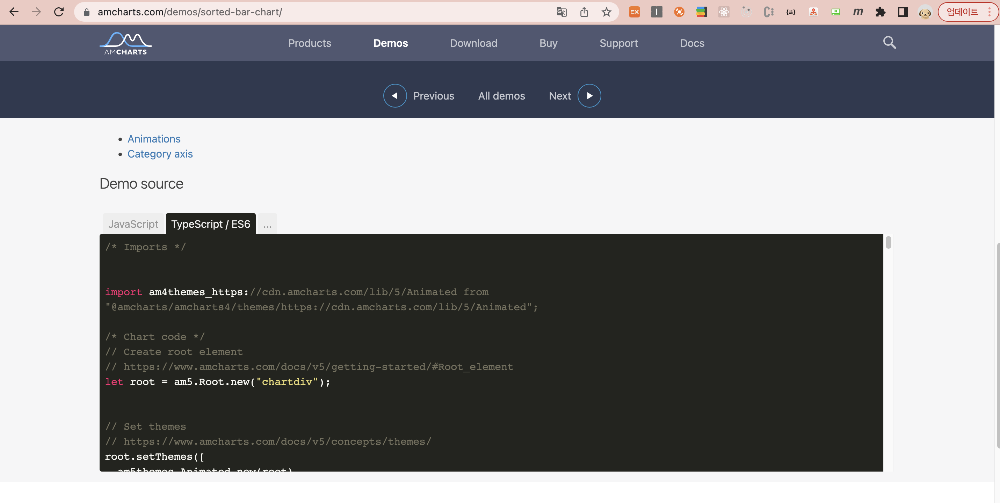
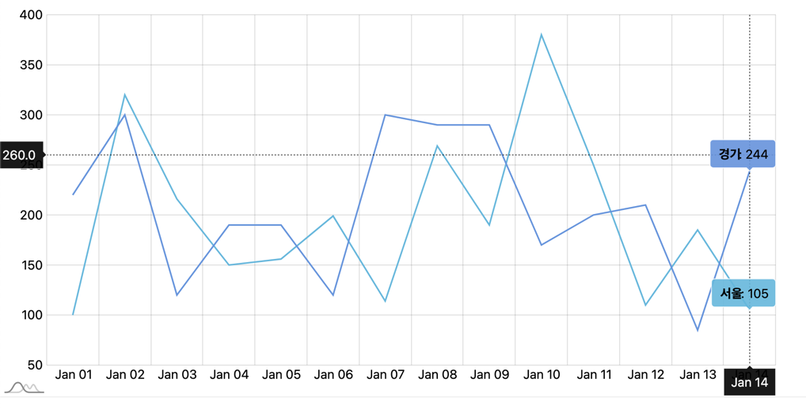

안녕하세요!

이번 포스팅 에서는 오픈소스 차트인 Amcharts4를 사용방법과 커스텀 하는 방법에 대해 소개해 드리겠습니다.

-----

### 1. 개요
- 여러가지 react 오픈소스 차트를 찾아보던 중에 알게된 차트인 [Amcharts](https://www.amcharts.com/demos/) 에 대해 작성해 보겠습니다. 차트 버전은 **amcharts4, 5**가 있고 공식 문서에 차트에 대한 설명과 데모가 자세히 나와 있어서 커스텀 하기에도 수월 했습니다.
- 참고 했던 다른 차트 중에서는 [charts.js](https://www.chartjs.org/) & [Highcharts](https://www.highcharts.com/) 가 있었는데 원하는 차트 모양이 가장 적절한 amcharts로 선택 하게 되었습니다.


### 2. Amcharts 사용 방법
- 공식 사이트는 [👉🏻이 곳](https://www.amcharts.com/) 입니다. 바 그래프, 원 그래프, 워드 클라우드 차트, 라인 차트 등 다양한 차트를 한눈에 볼 수 있고 버전 별로 비교해 볼 수 있습니다.
- 원하는 차트 유형을 선택 하고 데모 소스도 확인해 볼 수 있습니다.


- 그래프 별로 다양한 인터렉션과 애니메이션이 있어서 용도별로 다양하게 선택해서 사용할 수 있습니다.



### 3. 활용 방법
- 사용했던 ahcmarts5 차트를 간단하게 보여 드리겠습니다.
- 서울과 경기에 대한 갯수를 나타내는 라인 차트를 next.js에서 사용해 보았습니다.

  
- next.js(react.js)에서 amcharts를 사용할 때는 [dynamic](https://nextjs.org/docs/advanced-features/dynamic-import) 와 동기적으로 수행 되는 [useLayoutEffect](https://ko.reactjs.org/docs/hooks-reference.html#uselayouteffect) 를 사용해야 합니다. (각각에 대한 자세한 설명은 공식문서를 참고해 주세요!)
- 부모 컴포넌트: chart.tsx 파일
    - dynamic 함수를 사용하여 Charts를 호출 합니다. loading 중 일 경우에 나타낼 컴포넌트를 설정하고, ssr를 false로 셋팅 합니다.

```
import dynamic from "next/dynamic";

const Chart = dynamic(
    // @ts-ignore
    () => import("../components/chart/Chart"),
    { loading: () => <p>loading...</p>, ssr: false }
);

const chart = () => {
    return <Chart />;
}

export default chart;
```


- 자식 컴포넌트: Charts.tsx 파일
  1. useLayoutEffect 함수를 사용하여 차트를 생성합니다. 맨 마지막에 생성한 차트를 return 시켜줍니다.
  2. xAxis: x축에 대한 데이터 입력 (날짜)
  3. yAxis: y축에 대한 데이터 입력 (갯수)
  4. createSeries: 차트 그리는 부분
  5. strokeWidth: 라인 차트 두께
  6. series.get("tooltip").label.set("text", "[bold]{name}[/]: {valueY}"): 툴팁 글씨 셋팅
  7. chart.set("cursor"...): 차트 커서 셋팅 (alwaysShow: true일 경우에는 초기 셋팅 부터 커서가 노출 됩니다.)
  8. positionX, positionY: 커서의 위치 셋팅
  9. width: "1000px", height: "500px": 그래프 영역 크기 셋팅

```
import { useLayoutEffect } from "react";
import * as am4core from "@amcharts/amcharts4/core";
import am4themes_animated from "@amcharts/amcharts4/themes/animated";

import * as am5 from "@amcharts/amcharts5";
import * as am5xy from "@amcharts/amcharts5/xy";

am4core.useTheme(am4themes_animated);

const Chart = () => {
    useLayoutEffect(() => {
        let root = am5.Root.new("chartdiv");
        const chart = root.container.children.push(
            am5xy.XYChart.new(root, {
                wheelY: "zoomX"
            })
        );

        // 데이터 셋팅
        const data = [{
            date: new Date(2021, 0, 1).getTime(),
            value: 100,
            value2: 220
        }, {
            date: new Date(2021, 0, 2).getTime(),
            value: 320,
            value2: 300
        }, {
            date: new Date(2021, 0, 3).getTime(),
            value: 216,
            value2: 120
        }, {
            date: new Date(2021, 0, 4).getTime(),
            value: 150,
            value2: 190
        }, {
            date: new Date(2021, 0, 5).getTime(),
            value: 156,
            value2: 190
        }, {
            date: new Date(2021, 0, 6).getTime(),
            value: 199,
            value2: 120
        }, {
            date: new Date(2021, 0, 7).getTime(),
            value: 114,
            value2: 300
        }, {
            date: new Date(2021, 0, 8).getTime(),
            value: 269,
            value2: 290
        }, {
            date: new Date(2021, 0, 9).getTime(),
            value: 190,
            value2: 290
        }, {
            date: new Date(2021, 0, 10).getTime(),
            value: 380,
            value2: 170
        }, {
            date: new Date(2021, 0, 11).getTime(),
            value: 250,
            value2: 200
        }, {
            date: new Date(2021, 0, 12).getTime(),
            value: 110,
            value2: 210
        }, {
            date: new Date(2021, 0, 13).getTime(),
            value: 185,
            value2: 85
        }, {
            date: new Date(2021, 0, 14).getTime(),
            value: 105,
            value2: 244
        }];

        // Create Y-axis
        let yAxis = chart.yAxes.push(
            am5xy.ValueAxis.new(root, {
                extraTooltipPrecision: 1,
                renderer: am5xy.AxisRendererY.new(root, {
                    minGridDistance: 30
                })
            })
        );

        // Create X-Axis
        let xAxis = chart.xAxes.push(
            am5xy.DateAxis.new(root, {
                baseInterval: { timeUnit: "day", count: 1 },
                renderer: am5xy.AxisRendererX.new(root, {
                    minGridDistance: 20,
                    cellStartLocation: 0.2,
                    cellEndLocation: 0.8
                })
            })
        );

        // Create series
        function createSeries(name: string, field: string) {
            var series = chart.series.push(
                am5xy.LineSeries.new(root, {
                    name: name,
                    xAxis: xAxis,
                    yAxis: yAxis,
                    valueYField: field,
                    valueXField: "date",
                    tooltip: am5.Tooltip.new(root, {})
                })
            );

            series.strokes.template.setAll({
                strokeWidth: 2
            });

            series.events.on("datavalidated", function() {
                // @ts-ignore
                chart.get("cursor").setAll({
                    positionX: 0.99,
                    positionY: 0.4,
                    xAxis: xAxis,
                    yAxis: yAxis,
                    alwaysShow: true
                });
            });

            // @ts-ignore
            series.get("tooltip").label.set("text", "[bold]{name}[/]: {valueY}")
            series.data.setAll(data);
        }

        createSeries("서울", "value");
        createSeries("경기", "value2");

        // Add cursor
        chart.set("cursor", am5xy.XYCursor.new(root, {
            behavior: "none",
            xAxis: xAxis,
        }));

        xAxis.set("tooltip", am5.Tooltip.new(root, {
            themeTags: ["axis"]
        }));

        yAxis.set("tooltip", am5.Tooltip.new(root, {
            themeTags: ["axis"]
        }));

        return () => {
            chart.dispose();
        };
    }, []);

    return(
        <div id={"chartdiv"} style={{width: "1000px", height: "500px"}}/>
    )
}

export default Chart;
```

### 4. 마치며
- Next.js에서 amcharts5를 사용 하는 방법과 활용 방법에 대해 알아 보았습니다.
- 내용이 도움이 되셨다면 아래 **좋아요**나 **댓글** 부탁 드립니다!👍🏻

-----

오늘 준비한 내용은 여기까지 입니다.  
이번 포스팅이 도움이 되셨거나 궁금한 점이 있으시다면 언제든지 댓글을 달아주세요!🙋🏻‍♀️✨