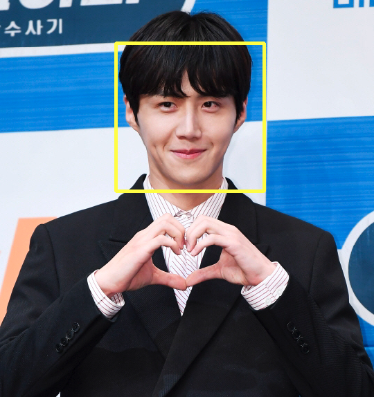
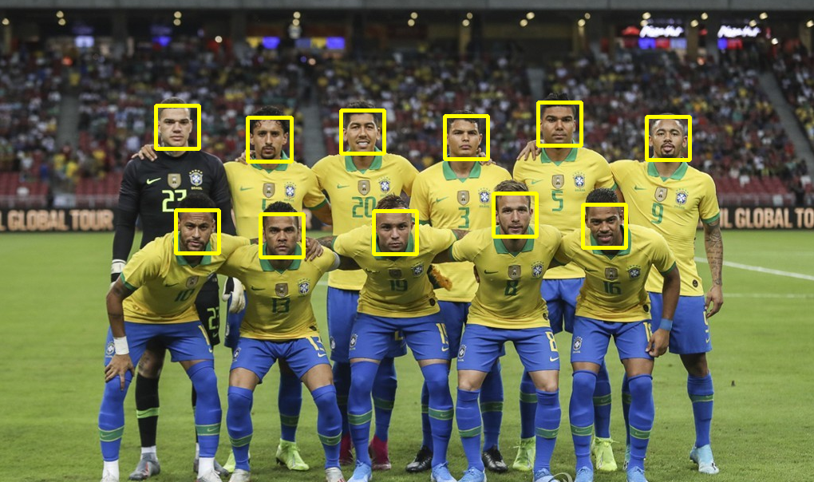

안녕하세요!  

이번 포스팅에서는 `OpenCV`를 사용 해서 **이미지 인식**을 통해 **얼굴만 사각형**으로 표시 하는 방법을 포스팅 해보 려고 합니다.   
아래 예제를 실행 하면서 발생한 에러와 해결 방안에 대해 정리한 내용은 [👉🏻여기](https://shinsangeun.github.io/posts/python/cv2-install) 를 참고해 주세요!


* 출처: `파이선을 이용한 머신러닝, 딥러닝 실전 개발 입문` 책에 있는 예제를 사용 하였습니다.

-----

### 개발 환경
- 개발 툴: Jupyter notebook
- Python 버전: 3.8.5
- 필요한 라이브러리: cv2, sys


### 코드 설명
- 아래 코드는 [👉🏻Github](https://github.com/shinsangeun/PythonStudy/tree/master/Opencv) 에서 볼 수 있습니다.

1. 실습에 필요한 `sys`, `cv2` 라이브러리를 import 합니다.
```python
import sys
sys.path.append('/usr/local/lib/python3.9/site-packages')
import cv2
``` 

2. 테스트 할 경로에 이미지 파일을 저장 하고 해당 경로의 이미지를 가져옵니다.  
(저는 같은 경로에 `soccer.jpg`라는 이미지 파일을 저장 하였습니다.) 
```python
image_file = "./soccer.jpg"
# Documents/Github/PythonExample/Opencv
```

3. 이미지 인식을 위해 `haarcascade_frontface.xml` 파일을 불러 옵니다.  
(이 때, 해당 경로에 저 xml 파일이 없으면 에러가 나므로 꼭 저장해 주셔야 합니다.)
```python
cascade_file = "./haarcascade_frontface.xml"
```

4. 이미지를 읽어서 인식합니다.
```python
image = cv2.imread(image_file)
image_gs = cv2.cvtColor(image, cv2.COLOR_BGR2GRAY)
cascade = cv2.CascadeClassifier(cascade_file)
```

5. 불러온 이미지 안에 감지된 사람의 얼굴이 몇명 인지 확인 합니다.
```python
faces = cascade.detectMultiScale(image_gs, 1.2, 5)
print("감지된 사람:", str(len(faces)))
```

6. 사람의 얼굴이 1명일 때, 2명이상 일 경우 명령어를 다르게 입력합니다. 2명이상 일 때는 더 정교한 파라미터로 수정합니다.
```python
# 사람 1명 일 때
face_list = cascade.detectMultiScale(image_gs, scaleFactor=1.1, minNeighbors=1, minSize=(150, 150))
print("face_list 길이:", str(len(face_list)))
```
```python
# 사람 2명 이상 일 때
face_list = cascade.detectMultiScale(image_gs, scaleFactor=1.1, minNeighbors=1, minSize=(50, 50), maxSize=(60,60))
print("face_list 길이:", str(len(face_list)))
```

7. 불러온 이미지 안에 인식된 사람의 얼굴을 사각형으로 표시 합니다.  
  사각형으로 표시된 이미지는 `facedetect-output.PNG`라는 이름으로 새로 이미지가 저장 됩니다.
```python
if len(face_list) > 0:
    print(face_list)
    color = (0,255,255)
    for face in face_list:
        x,y,w,h = face
        # 사각형 그리기
        cv2.rectangle(image, (x,y), (x+w, y+h), color, thickness=3)
    cv2.imwrite("facedetect-output.PNG", image)
else:
    print("no face")
```


### 결과
- 실행 전
  - 1명일 때: 요즘 가장 핫한 배우인 `김선호`님의 이미지를 사용해 보았습니다..😆  
    
  - 2명이상 일 때: 여러명의 이미지로 쓰기 좋은 축구단 이미지를 사용해 보았습니다..😆  
   

- 실행 후
  - 1명일 때  
    
  - 2명이상 일 때  
   


### 마치며
Python의 **OpenCV** 라이브러리를 이용해서 생각보다 쉽게 이미지 인식을 해볼 수 있었습니다!  
여러분도 직접 해보시면서 재미있게 느끼셨으면 좋겠습니다.

-----


오늘 준비한 내용은 여기까지 입니다.  
이번 포스팅이 도움이 되셨거나 궁금한 점이 있으시다면 언제든지 댓글을 달아주세요!🙋🏻‍♀️✨    