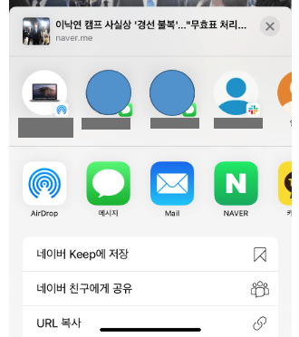
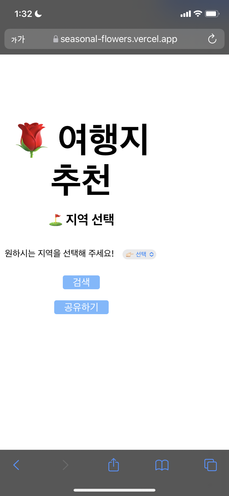
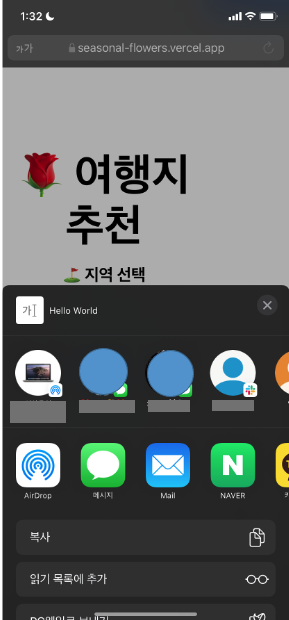
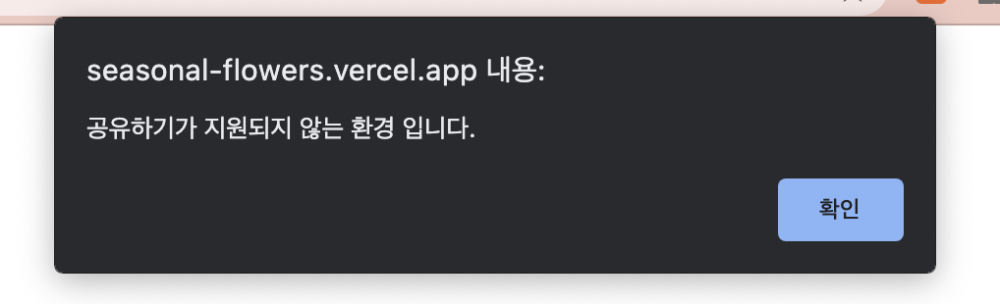
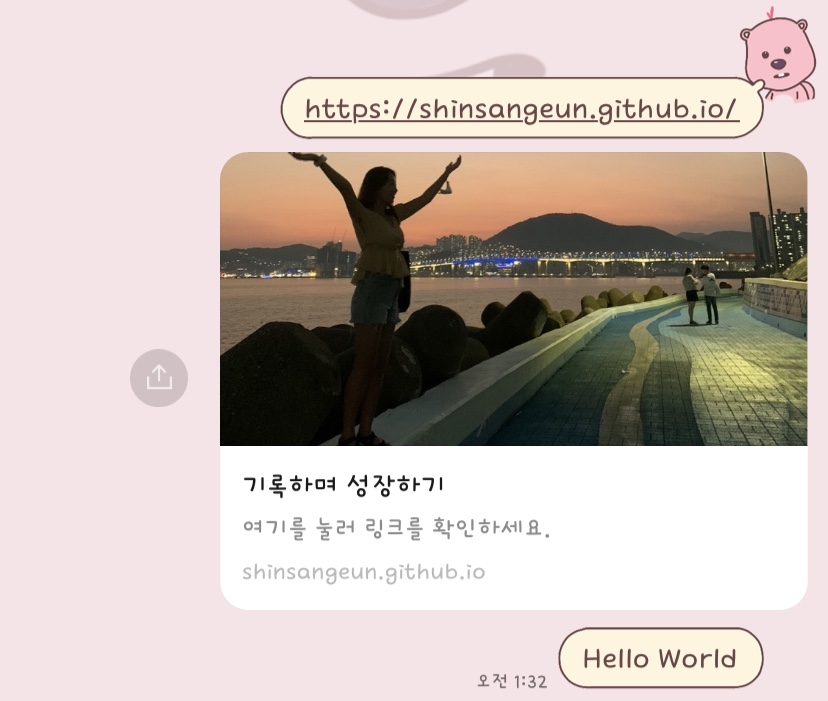

안녕하세요!

이번 포스팅 에서는 `React.js`를 사용해서 모바일 웹에서 페이지 공유하기 기능을 소개해 드리겠습니다.
모바일 웹 공유하기 시, 사용할 라이브러리는 Web share api 입니다.

-----
### 1. 모바일 웹 공유하기
- 모바일 웹 공유하기 기능이란, 카카오나 네이버에서 웹 페이지 링크를 공유 할 때 '공유하기' 버튼을 누르면 하단에 나타나는 팝업 기능 입니다.
- 예를 들어 ios에서 하단에 공유하기 버튼을 누르면 아래와 같은 창이 나타납니다. (안드로이드 에서도 팝업이 하단에 나타납니다.)

  
- 카카오톡, 문자 메세지, Slack 등등 어떤 메신저로 공유 할지 선택 해서 해당 페이지를 공유할 수 있습니다.


### 2. Web share api 사용 방법
- 이렇게 공유하기 기능을 개발 하기 위해서는 **Web share api**를 이용 하는데요. 사용 방법은 의외로 아주 간단 합니다.
- 기본예제는 아래와 같습니다.
    - url: 공유할 URL을 작성합니다.
    - text: 공유할 본문을 작성합니다.
    - title: 공유할 제목을 작성합니다.

```
if (navigator.share) {
  navigator.share({
      title: '기록하며 성장하기',
      text: 'Hello World',
      url: 'https://shinsangeun.github.io',
  })
    .then(() => console.log('공유 성공'))
    .catch((error) => console.log('공유 실패', error));
}
```


**[📍주의 사항]**
1) 해당 기능은 **https://** 환경에서만 지원 된다는 특징이 있습니다. **http://** 인 환경에서는, 공유하기 기능이 실행 되지 않습니다.
2) text, url 두 속성 중 하나 이상을 필수로 넣어야 합니다. 
3) navigator.share가 지원 되는 환경에서는 실행 되고, 지원 되지 않는 환경에서는 `undefined`가 return 됩니다.


### 3. React.js 사용 방법
- 간단한 예제 코드를 적용해 보았습니다.
```
  const SearchBtn = styled.button`
      margin: 10px;
      border: none;
      border-radius: 4px;
      height: 25px;
      font-size: 18px;
      background-color: #74b9ff;
      color: white;
      :hover{
          background-color: #99c6f5;
      }
  `;
  
  const handle = () => {
      if (navigator.share) {
          navigator.share({
              title: '기록하며 성장하기',
              text: 'Hello World',
              url: 'https://shinsangeun.github.io',
          });
      }else{
          alert("공유하기가 지원되지 않는 환경 입니다.")
      }
  }
  
  const season = () => {
      return(
       <SearchBtn onClick={() => {handle()}}>
            공유하기
        </SearchBtn>
    )
  }
```

## 결과
1. https:// 페이지에서 `공유하기` 버튼 생성
  
     
2. `Web share api`가 지원 되는 환경일 때
  
     
3. `Web share api`가 지원 되지 않는 환경일 때

     
4. `카카오톡` 공유하기 결과

   
  - 작성한 title, text, url이 정상적으로 공유 되는 것을 확인 할 수 있습니다.


### 4. 마치며
- 이번에 실무에서 필요하게 된 기능을 구현 하게 되어서 정리하게 되었습니다.
- 모바일 웹 사용량이 늘어나면서, 간단한 Web API를 통해 토이 프로젝트에서도 사용하기 좋을 기능 인 것 같아요!


-----

오늘 준비한 내용은 여기까지 입니다.  
이번 포스팅이 도움이 되셨거나 궁금한 점이 있으시다면 언제든지 댓글을 달아주세요!🙋🏻‍♀️✨    

