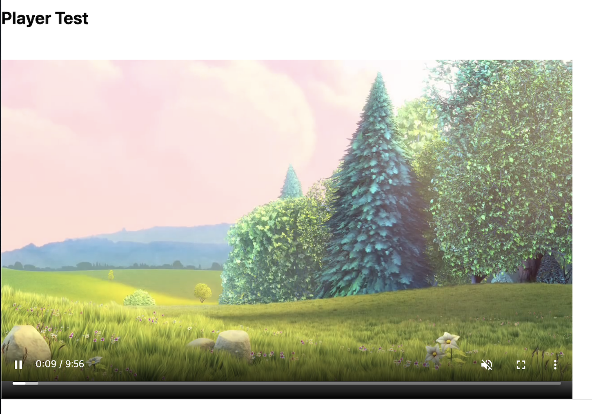

안녕하세요!

오늘은 React.js 기반의 **react-player** 라는 라이브러리에 대해 소개해 보겠습니다.
플레이어 기능이 들어가는 프로젝트가 있어서 리서치 하다가 알게된 라이브러리 인데, 실제로 써보니까 간단하고 유용한 라이브러리여서 블로그에 정리해 보겠습니다.  

-----

### 1. 소개
- 플레이어로 가장 많이 쓰고 유명한 `video.js`를 리서치 하다가 react.js 기반의 플레이어를 찾게 되었습니다.
- 몇 가지 라이브러리를 찾게 되었는데 그 중에서 `react-player`, `react-video`가 구현 내용에 적합 했습니다.


### 2. 요구사항
아래의 요구사항에 맞는 플레이어 라이브러리를 조사 하다 보니, react 기반 라이브러리 중에서는 `react-player` 가 가장 적합 했습니다.  

1. 자동 재생 (autoPlay)
   - 플레이어가 끝났을 때 다음 영상 자동 재생 
   - 기본 설정은 음소거 상태 (브라우저 별로 자동 재생 정책이 다르기 때문)
2. 플레이어 광고 없음
   - 광고가 붙으면, 여러가지 라이브러리를 붙여야 하기 때문에 일단 배제 함
3. 간단하고 쓰기 쉬운 플레이어
   - 러닝 커브가 낮은, 빨리 가져다 쓰기 편한 라이브러리
4. React.js(Next.js) 프로젝트에 사용하기 편한 라이브러리
5. Control UI 커스텀 가능
   - 재생, 일시정지, 뒤로가기 등 UI 커스텀 가능 범위
6. 다양한 브라우저 호환
   - IE, Chrome, Firefox, Edge...등
   

### 3. 기본 셋팅
- [npm 사이트](https://www.npmjs.com/package/react-player) 에 내용이 잘 정리되어 있어서, 플레이어 샘플 코드를 실행 시킵니다.
- 개발 시작 하기 전에 [테스트 페이지](https://cookpete.com/react-player/) 에서 플레이어를 커스텀 하고 테스트 할 수 있습니다.

#### 1. 패키지 설치
```
npm i react-player
```

#### 2. 테스트 코드

```
import ReactPlayer from 'react-player/lazy';

const Video = ({playList, index}) => {
    return (
        <>
            <h2>Player Test</h2>
            <div className='player-wrapper'>
                <ReactPlayer
                    className='react-player'
                    url={'https://commondatastorage.googleapis.com/gtv-videos-bucket/sample/BigBuckBunny.mp4'}    // 플레이어 url
                    width='800px'         // 플레이어 크기 (가로)
                    height='500px'        // 플레이어 크기 (세로)
                    playing={true}        // 자동 재생 on
                    muted={true}          // 자동 재생 on
                    controls={true}       // 플레이어 컨트롤 노출 여부
                    light={false}         // 플레이어 모드
                    pip={true}            // pip 모드 설정 여부
                    poster={'https://commondatastorage.googleapis.com/gtv-videos-bucket/sample/images/BigBuckBunny.jpg'}   // 플레이어 초기 포스터 사진
                    onEnded={() => handleVideo()}  // 플레이어 끝났을 때 이벤트
                />
            </div>
        </>
    )
}

export default Video;
```
- 자동 재생 설정을 하려면, playing과 muted를 **true**로 해야 autoplay 설정이 됩니다.
- 위의 코드를 로컬에서 실행하면 아래와 같은 화면이 나타납니다.

  

#### 3. 플레이어 커스텀 하기
- 플레이어 영상이 끝났을 때 다음 영상이 자동 재생 되도록 하는 기능을 추가해 보겠습니다.

```
<ReactPlayer
  url={[
    'https://www.youtube.com/watch?v=oUFJJNQGwhk',
    'https://www.youtube.com/watch?v=jNgP6d9HraI'
  ]}
/>
```
- Youtube의 경우 링크가 여러개 일 때 플레이어 영상 링크를 배열로 **url**에 넣어주면 알아서 다음 영상으로 자동 재생이 됩니다.

- **ReactPlayer** 안에 **onEnded** 라는 이벤트 함수가 있는데, 이 함수는 <U>플레이어 영상이 끝났을 때 실행 되는 이벤트</U> 입니다.
- onEnded 함수 안에 <U>플레이어 url을 다음 영상으로 교체하여 재생 시키는 기능</U>을 구현 해 보겠습니다. (자세한 설명은 [npm 설명](https://www.npmjs.com/package/react-player) 에 있는 **Callback Props** 부분을 참고 해주세요!)

- 아래는 Typescript 기반 소스 입니다.

```
import ReactPlayer from 'react-player/lazy';
import React, {useEffect, useState} from "react";

type VideoPlayerProps = {
    title: string;
    vodPlaylistId: string;
}

const VideoPlayer = ({title, vodPlaylistId}: VideoPlayerProps) => {
    const [playIndex, setPlayIndex] = useState(0);
    const playList = [
        {index:1, url: 'https://commondatastorage.googleapis.com/gtv-videos-bucket/sample/BigBuckBunny.mp4'},
        {index:2, url: 'http://sample.vodobox.net/skate_phantom_flex_4k/skate_phantom_flex_4k.m3u8'},
        {index:3, url: 'http://playertest.longtailvideo.com/adaptive/wowzaid3/playlist.m3u8'}
    ];

    const handleNextVideo = (video: string | any[], playIndex: number) => {
        if(playIndex === video.length - 1){
            setPlayIndex(0);
        }else{
            setPlayIndex(playIndex + 1);
        }
    }

    const selectVideo = (index: number) => {
        setPlayIndex(index);
    }

    if(playList === null) return <p>Loading...</p>;

    return (
        <>
            <h2>Player Test</h2>
            <ReactPlayer
                url={playList[playIndex].url}
                playing
                controls
                muted
                progressInterval={1000}
                pip={true}
                onEnded={() => {handleNextVideo(playList, playIndex)}}
                width={'800px'}
                height={'500px'}
            />
        </>
    )
}

export default VideoPlayer;
```

- **playList** 를 정의 해놓고 **handleNextVideo** 라는 함수를 만들어서, **onEnded** 함수가 호출 될 때 마다 video 배열의 index를 1씩 증가 시킵니다.
- 만약 playList를 API를 통해 받아와야 한다면, <U>useEffect 부분에 axios API 연동하는 부분을 추가</U>해서 url을 동적으로 생성 할 수 있습니다.
- 현재 **react-player**에서 youtube 타입 영상은 영상에 인덱스가 있어서 onEnded 함수를 구현하지 않아도 자동 재생이 지원이 되는데, 다른 타입의 영상은 지원이 되지 않는다고 해서 handleNextVideo 함수를 구현 해 보았습니다. 


### 4. 마치며
- 엄청난 삽질 끝에...자동 재생을 추가하게 되어서 블로그에 정리해 보았습니다. react-player 라이브러리를 사용하시는 분들께 유용한 포스팅이 되었으면 좋겠습니다.
- 다른 기능을 추가하게 된다면 한번 더 정리 해 보겠습니다!🥲

-----

오늘 준비한 내용은 여기까지 입니다.  
이번 포스팅이 도움이 되셨거나 궁금한 점이 있으시다면 언제든지 댓글을 달아주세요!🙋🏻‍♀️✨    


