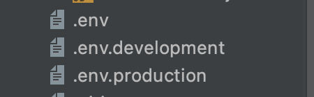

안녕하세요!

이번 포스팅 에서는 배포 환경에 따라 CRA(Create-React-App)로 생성한 `React.js` 프로젝트 에서 환경 변수를 설정하는 방법에 대해 알아보겠습니다.

-----

### 1. 개요
- 프로젝트를 개발하다 보면, 배포 환경에 따라 환경변수를 다르게 셋팅 해야 할 경우가 있습니다.
- 예를 들어, API 주소를 호출 할 때도 운영 API 주소는 `api.example.com` 이고 개발 API 주소는 `apidev.example.com` 일 때 배포 환경에 따라 호출 URL을 바꿔서 호출해 줘야 합니다. 또한 개발용 포트는 3000번으로 띄우고 싶은데, 운영 서버용 포트는 3001번으로 사용하고 싶은 경우가 있습니다.
- 따라서 배포 환경에 따라 환경 변수를 다르게 설정해 줘야 하므로 적용 하는 방법을 아래 정리해 보겠습니다.

### 2. React.js 설정 방법
- React.js를 사용할 때 `CRA(Create-React-App)` 프로젝트로 만들어서 적용 하였습니다.
- 환경 변수를 셋팅 하기 위해서는 자신의 프로젝트 루트 경로에 파일을 생성 합니다. `.env`, `.env.development`, `.env.local`, `.env.production`, `.env.test` 여러가지 종류가 있는데 본인이 사용하는 용도에 따라 필요한 파일을 생성 합니다.


- 생성한 파일의 우선순위는 빌드 종류 별로 적용 됩니다. (왼쪽이 우선순위가 더 높습니다.)

```
start: .env.development > .env 
build: .env.production > .env.development
test: .env.test > .env 
```

(ex1) .env 파일
```
REACT_APP_API_URL = https://api.example.com
REACT_APP_PORT = 3000
```

(ex2) .env.development 파일
```
REACT_APP_API_URL = https://api.example.com
REACT_APP_PORT = 3001
```

- 소스 코드에서 환경 변수를 호출 하기 위해서는 변수 앞에 `process.env`를 붙여 줍니다.
- 저는 재사용성을 위해서 전역 변수로 선언하고 사용 하였습니다. (개인의 취향에 따라 선언 하시면 됩니다.)

```
const API_URL = process.env.REACT_APP_API_URL;
axios(API_URL, ...)
```

- **package.json**에 있는 scripts를 보면, 자신이 생성한 환경 변수에 따라 빌드 할 수 있습니다.

```
"scripts": {
    "start": "react-scripts start",
    "build": "react-scripts build",
    "test": "react-scripts test",
    "eject": "react-scripts eject"
}
```

- 여기에서 특정 환경 변수의 우선순위를 강제로 높여서 빌드를 하고 싶을 경우에는 `env-cmd -f` 명령어를 추가하여 빌드를 실행 합니다.
- 먼저 **npm i env-cmd** 로 env-cmd 라이브러리를 설치 해야 합니다. 라이브러리를 추가한 이후에 아래 명령어를 추가해서 테스트 합니다. (콘솔에 환경 변수를 출력해서 제대로 적용이 되었는지 확인 합니다.)
- start 스크립트의 환경 변수 우선 순위가 `.env.development`가 더 높은데, `.env`로 적용 하고 싶으면 아래와 같이 스크립트를 수정 합니다. 

```
"start": "env-cmd -f .env react-scripts start",
```

- 로컬 개발과 배포 빌드 start 스크립트를 다르게 설정 하고 싶을 경우에는 스크립트 실행 이름을 아래와 같이 설정 할 수도 있습니다.

```
"start": "react-scripts start",
"start:prod": "env-cmd -f .env react-scripts start",
```

### 3. 마치며
- 다음 포스팅에서는 React.js와 비교해서 Next.js에서 환경 변수 셋팅하는 방법을 정리해 보겠습니다.
- 내용이 도움이 되셨다면 아래 **좋아요**나 **댓글** 부탁 드립니다!👍🏻

-----

오늘 준비한 내용은 여기까지 입니다.  
이번 포스팅이 도움이 되셨거나 궁금한 점이 있으시다면 언제든지 댓글을 달아주세요!🙋🏻‍♀️✨    

