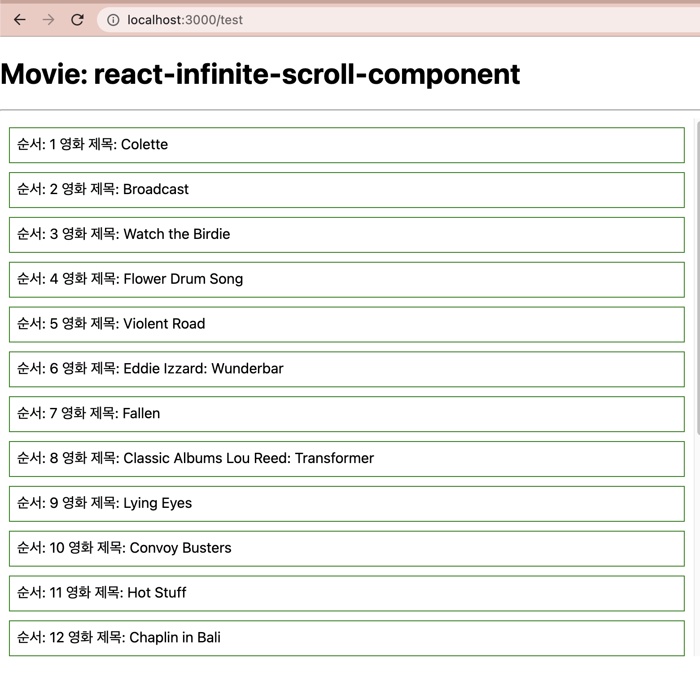
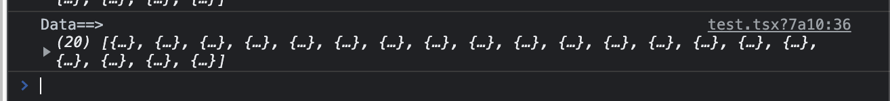
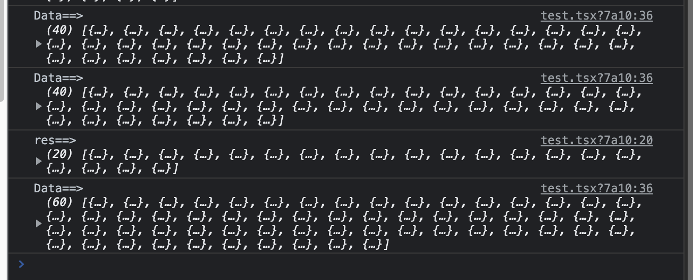
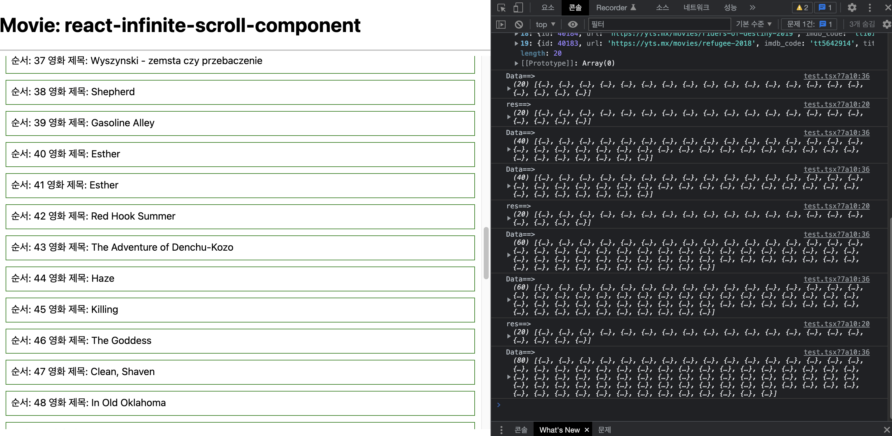
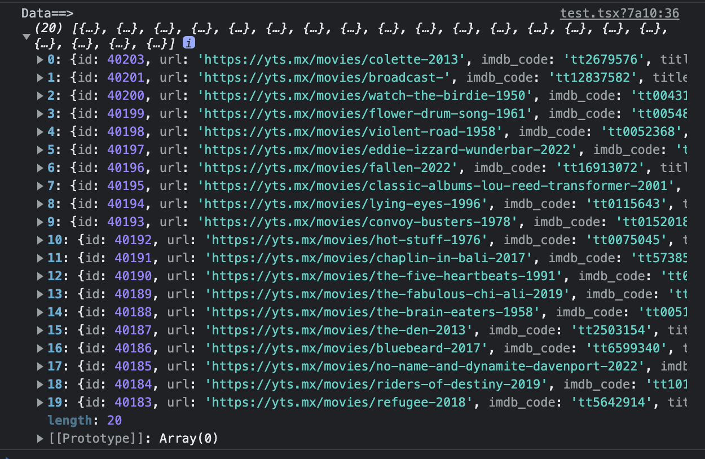

안녕하세요!

이번 포스팅 에서는 무한 스크롤 라이브러리를 활용 하여 `React.js` 프로젝트에서 사용하는 방법에 대해 소개해 드리겠습니다.

-----

### 1. 개요
- 데이터가 많아지면 페이지 로딩이 느려지는 이슈가 있어서, 개선 방법을 찾아보다가 스크롤 시 마다 데이터를 호출 하면 페이지 로딩 속도를 빠르게 할 수 있다는 아이디어를 얻게 되었습니다.
- React에서 무한 스크롤을 사용하기 위해서 여러가지 라이브러리를 찾아 보게 되었습니다. 다양한 단어(`무한 스크롤`, `react-virtualize`, `infinite-scoll`)로 불리는 무한 스크롤을 쉽고 간단하게 사용 할 수 있는 라이브러리를 선택 해 보았습니다.
- 제가 선택한 무한 스크롤 라이브러리는 **react-infinite-scroll-component** 입니다. 


### 2. react-infinite-scroll-component 사용 방법
- 공식 사이트: [Github 링크](https://github.com/ankeetmaini/react-infinite-scroll-component), [npm 링크](https://www.npmjs.com/package/react-infinite-scroll-component), [sandbox 예제](https://codesandbox.io/s/r7rp40n0zm?file=/src/index.js:91-122)
- (2022.02 기준) 현재 주간 다운로드 수는 **382,210** 이고, 6년전 부터 아직까지는 꾸준히 업데이트 되고 있어요.
- 여러가지 무한 스크롤 관련 라이브러리를 직접 사용 해 보았을 때, 소스가 직관적이고 사용하기 편해서 선택하게 되었습니다. (⛔️ 개인적인 견해이기 때문에 꼭! 이 라이브러리를 필수로 사용 해야 한다는 것은 아니니 참고만 부탁 드립니다.)

#### 모듈 설치 및 설명

1. 해당 라이브러리를 사용하기 위해서 먼저 모듈을 설치 해줍니다.
```
npm install react-infinite-scroll-component
```

2. Github 링크에서 `README.md`에 있는 글을 바탕으로 간략하게 설명 해 드리겠습니다.
- 기본 예제 코드

```
<InfiniteScroll
  dataLength={items.length} //This is important field to render the next data
  next={fetchData}
  hasMore={true}
  loader={<h4>Loading...</h4>}
  endMessage={
    <p style={{ textAlign: 'center' }}>
      <b>Yay! You have seen it all</b>
    </p>
  }
  // below props only if you need pull down functionality
  refreshFunction={this.refresh}
  pullDownToRefresh
  pullDownToRefreshThreshold={50}
  pullDownToRefreshContent={
    <h3 style={{ textAlign: 'center' }}>&#8595; Pull down to refresh</h3>
  }
  releaseToRefreshContent={
    <h3 style={{ textAlign: 'center' }}>&#8593; Release to refresh</h3>
  }
>
  {items}
</InfiniteScroll>
```

#### InfiniteScroll 컴포넌트 파라미터 설명

- dataLength: 데이터를 로드할 때 사용 하는 data 길이 (필수: 없으면 에러)
- next: 다음 데이터를 호출 하기 위해 사용 하는 함수
- hasMore: 스크롤 뒤에 호출 할 데이터의 유/무 (없으면 false로 해도 되지만, false 일 때는 스크롤을 아래로 내렸을 때 데이터 호출 되지 않음)
- loader: 데이터가 로딩 중일 때 표시 되는 문구 or 컴포넌트
- endMessage: 데이터 호출이 완료 되고 더이상 데이터가 없을 경우 표시되는 문구 or 컴포넌트
- 아래 있는 내용은 저도 사용해 보지는 않았지만, pull down 시 사용하는 함수 입니다.


### 3. 활용 방법
- 실제 사용 할 때는 API 연동을 해서 사용하기 때문에 **react-infinite-scroll-component**의 [sandbox 예제](https://codesandbox.io/s/r7rp40n0zm?file=/src/index.js:91-122) 를 활용 해서 `API 연동`과 `페이징`을 추가 했습니다.
- 무한 스크롤을 하기 위해 API 연동이 필요 하여 [영화 API](https://yts.mx/api/v2/list_movies.json) 를 사용 하였습니다.


- 예제 활용 코드 (test.tsx 파일)

```
import InfiniteScroll from "react-infinite-scroll-component";
import {useEffect, useState} from "react";
import axios from "axios";

const style = {
    height: 40, border: "1px solid green", margin: 10, padding: 8
};

const test = () => {
    const [pageNum, setPageNum] = useState(1);
    const [data, setData] = useState('');

    const getMovieList = async (pageNum: number) => {
        await axios
            .get(`https://yts.mx/api/v2/list_movies.json?page=${pageNum}`)
            .then((res) => {
                data === '' ? setData(res.data.data.movies) : setData(data.concat(res.data.data.movies));
            });
    }

    useEffect( () => {
        getMovieList(pageNum);
    }, []);

    const fetchMoreData = () => {
        setPageNum (pageNum +1);
        getMovieList(pageNum+1);
    }

    if(data === '' || data === undefined) return <>loading...</>;

    console.log("Data==>", data);

    return(
        <div>
            <h1>Movie: react-infinite-scroll-component</h1>
            <hr />
            <div id="scrollableDiv" style={{ height: 600, overflow: "auto" }}>
                <InfiniteScroll
                    dataLength={data.length}
                    next={fetchMoreData}
                    hasMore={true}

                    // next={type === "movie" ? fetchMoreData : () => {}}
                    // hasMore={type === "movie"}

                    loader={<h4>Loading...</h4>}
                    scrollableTarget="scrollableDiv"
                >
                    {data.map((i: any, index: number) => (
                        <div style={style} key={index}>
                            순서: {index+1} 영화 제목: {data[index].title}
                        </div>
                    ))}
                </InfiniteScroll>
            </div>
        </div>
    )
}

export default test;
```

#### 코드 설명

1. 페이지가 랜딩 될 때 `useEffect`를 통해 `getMovieList(pageNum)` 함수를 한번 호출 합니다.
2. `https://yts.mx/api/v2/list_movies.json?page=${pageNum}` API를 호출 하여 pageNum이 1인 데이터를 호출 합니다.
3. 처음 데이터 호출 시에는 data가 `useState('')` 이므로 `setData(res.data.data.movies)`가 실행 됩니다.
   
4. 데이터 호출이 정상적으로 되면 아래와 같이 리스트가 화면에 나타납니다.

   
5. F12를 눌러서 콘솔창을 확인 해 보시면, 데이터의 갯수와 내용을 확인 할 수 있습니다.

   
6. 스크롤을 내리다가 스크롤이 화면 맨 아래쪽에 위치 했을 때, `next` 파라미터에 있는 `fetchMoreData` 함수가 실행 됩니다. (`hasMore`가 **true**인 상태에서! **false**일 때는 동작하지 않음)
   
7. `fetchMoreData` 함수 에서는 pageNum을 1페이지씩 증가 시키고, `getMovieList(pageNum+1)` 함수를 다시 호출 합니다. 초기에는 1페이지의 데이터를 호출하고, 다음 부터는 2, 3, 4...페이지 번호를 하나씩 늘리면서 API 데이터를 호출 하게 되는 <U>페이징 처리</U>가 가능 합니다.
```
const fetchMoreData = () => {
        setPageNum (pageNum +1);
        getMovieList(pageNum+1);
}
```

8. `getMovieList(pageNum+1)` 함수가 실행 되면 setData를 할 때  
   초기 로딩 시에는 <U>setData(res.data.data.movies)</U> 함수가 실행 되고, 데이터가 있을 경우에는 <U>setData(data.concat(res.data.data.movies))</U> 함수가 실행됩니다.  
   **concat** 함수를 사용하여 데이터를 합칩니다.
```
data === '' ? setData(res.data.data.movies) : setData(data.concat(res.data.data.movies));
```

9. 무한 스크롤이 정상 동작 하면 스크롤을 내릴 때 마다 API 데이터의 다음 페이지를 호출 하여 데이터가 점차 늘어 납니다.  
  


10. 다른 데이터를 화면에 보여 주고 싶으면 콘솔의 데이터를 확인 하셔서 원하는 파라미터를 사용 하시면 됩니다.



### 4. 마치며
- 이 방법을 통해 페이지 로딩 지연 이슈를 개선 하게 되었고, 무한 스크롤을 구현하기 위해 여러가지 방법을 시도해 보다가 블로그에 정리해 보았습니다.
- 또한 `ie11`, `safari`, `chrome`, `edge` 등 <U>다양한 브라우저에서도 모두 정상 동작 한다는 점</U>이 매우 마음에 들었습니다. 무한 스크롤을 구현하게 되신다면 추천 드립니다!
- 내용이 도움이 되셨다면 아래 **좋아요**나 **댓글** 부탁 드립니다!👍🏻

-----

오늘 준비한 내용은 여기까지 입니다.  
이번 포스팅이 도움이 되셨거나 궁금한 점이 있으시다면 언제든지 댓글을 달아주세요!🙋🏻‍♀️✨    

