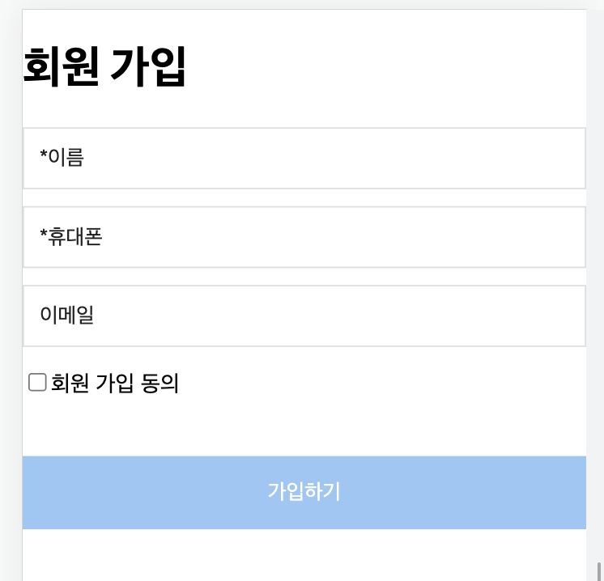
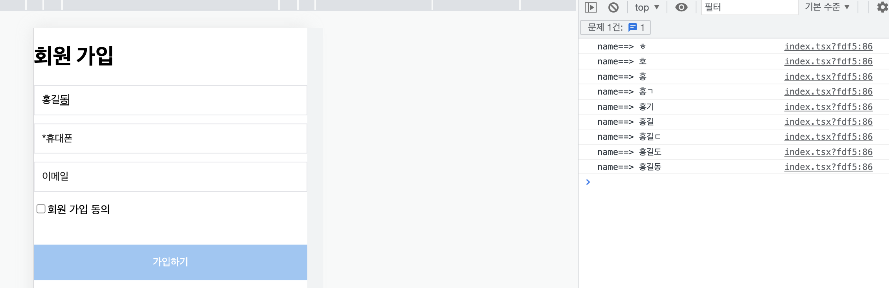

안녕하세요!

이번 포스팅 에서는 React.js에서 회원가입 기능을 구현해 보고 **useCallback** 함수를 사용하여 유효성 체크 하는 방법에 대해 알아보겠습니다.

-----

### 1. 개요
회원가입 시 필요한 이름, 휴대폰, 이메일을 만들고 유효성 체크 기능을 구현 해 보겠습니다.
- 이름: 필수값, 한글만 등록 가능, 10글자 이하 (홍길동)
- 휴대폰: 필수값, 숫자만 등록 가능, 11글자 이하 (010-1111-2222)
- 이메일: 선택값, 영문만 등록 가능 (test@test.com)
- 회원 가입 동의: 필수값, 체크 안하면 등록 안됨




### 2. 화면 구현
⛔ ️styled-components 부분은 생략 하였습니다.

1. 이름 값에 입력 할 때마다 **onChangeName** 가 실행 됩니다.
2. 휴대폰 값을 입력 할 때마다 **onChangePhone** 함수가 실행 됩니다.
3. 이메일을 입력 할 때마다 **onChangeEmail** 함수가 실행 됩니다.
4. 회원 가입 동의 체크 박스 선택 시 **changeHandler** 가 실행 됩니다.

```
return(
    <>
        <h1>회원 가입</h1>
        <Text type="text" name="name" onChange={onChangeName} placeholder={"*이름"}/>
        <Text type="number" name="phone" onChange={onChangePhone} placeholder={"*휴대폰"}/>
        <Text type="text" name="email" onChange={onChangeEmail} placeholder={"이메일"}/>
        <input style={{display: 'inline-block'}} className={"input-txt"} type="checkbox" id="consentCheck" onChange={e => {changeHandler(e.currentTarget.checked, 'consentCheck')}}/>
        <p style={{display: 'inline-block'}}>회원 가입 동의</p>
        <Submit onClick={() => onSubmit()}>
            <SubmitText>가입하기</SubmitText>
        </Submit>
    </>
)
```


### 3. 구현 방법

#### 3-1. 초기 변수값 셋팅
- 이름, 휴대폰, 이메일에 대한 변수 값과 유효성 체크에 대한 변수 값을 **useState**로 선언 합니다.

```
const [name, setName] = useState<string>('');       // 이름
const [phone, setPhone] = useState<string>('');     // 휴대폰
const [email, setEmail] = useState<string>('');     // 이메일

const [isName, setIsName] = useState<boolean>(false);       // 이름 유효성 체크 
const [isKor, setIsKor] = useState<boolean>(false);         // 한글 유효성 체크
const [isPhone, setIsPhone] = useState<boolean>(false);     // 휴대폰 유효성 체크
const [isEmail, setIsEmail] = useState<boolean>(false);     // 이메일 유효성 체크
const [isChecked, setIsChecked] = useState<boolean>(false);       // 동의 여부 유효성 체크
```

#### 3-2. 유효성 체크 함수
1. 한글 체크

```
const checkKor = (str: string) => {
    const regExp = /[ㄱ-ㅎㅏ-ㅣ가-힣]/g;
    return regExp.test(str);
}
```

2. 영문 체크

```
const checkEng = (str: string) => {
    const regExp = /[a-zA-Z]/;
    return regExp.test(str);
}
```

3. 특수문자 체크

```
const checkSpc = (str: string) => {
    const regExp = /[~!@#$%^&*()_+|<>?:{}]/;
    return regExp.test(str);
}
```

#### 3-3. 유효성 체크 함수 (useCallback)

input 값에 값을 입력 할 때마다 console 에 값이 찍히도록 추가 했는데, 값이 변할 때 마다 콘솔에 **e.target.value** 이 찍혀서 변수 값을 셋팅 할 수 있습니다.


1. onChangeName 함수 (setIsName, setIsKor, setName을 셋팅 함)
   - regex.test(e.target.value) 이 true 이고, 이름 입력 값 length가 0 일 경우 `setIsName`는 **false**로 셋팅
   - e.target.value 값이 한글이고, 영어가 아니고, 특수문자가 아니고, 입력 값 length가 1 < value <= 50 일 경우 `setIsKor`, `setIsName` 둘 다 **true**로 셋팅
   - e.target.value 값이 한글이 아니거나, 영어거나, 특수문자가 있거나, 입력 값 length가 1 < value <= 50 일 경우 `setIsKor`는 **false**, `setIsName`은 **true**로 셋팅
   - e.target.value 값이 한글 이고, 입력 값 length가 1 < value <= 50 일 경우 `setName`에 입력 값 셋팅, `setIsName`은 **true**로 셋팅 / 아니면 `setIsName`는 **false**로 셋팅
   
```
const onChangeName = useCallback((e: React.ChangeEvent<HTMLInputElement>) => {
   if(e.target.value.length === 0){
     setIsName(false);
   }
   
   if(checkKor(e.target.value) && !checkEng(e.target.value) && !checkSpc(e.target.value) && (e.target.value.length > 1 && e.target.value.length <= 50)){
     setIsKor(true);
     setIsName(true);
   }
   
   if(!checkKor(e.target.value) || checkEng(e.target.value) || checkSpc(e.target.value) && (e.target.value.length > 1 && e.target.value.length <= 50)){
     setIsKor(false);
     setIsName(true);
   }
   
   if(checkKor(e.target.value) && (e.target.value.length > 1 && e.target.value.length <= 50)){
     setName(e.target.value);
     setIsName(true);
   } else if(e.target.value.length <= 1 && e.target.value.length > 50 || e.target.value.length === 0){
     setIsName(false);
   }
}, [])
```

2. onChangePhone 함수 (setPhone, setIsPhone을 셋팅 함)
   - regex.test(e.target.value) 이 true 이고, 휴대폰 입력 값 length가 10 이나 11일 경우 `setPhone`에 값을 넣고, `setIsPhone`는 **true**로 셋팅 / 아니면 `setIsPhone`는 **false**로 셋팅

```
const onChangePhone = useCallback((e: React.ChangeEvent<HTMLInputElement>) => {
   const regex = /^01([0|1|6|7|8|9])-?([0-9]{3,4})-?([0-9]{4})$/;
   
   if (regex.test(e.target.value) && e.target.value.length === 10 || e.target.value.length === 11) {
     setPhone(e.target.value);
     setIsPhone(true);
   } else {
     setIsPhone(false);
   }
}, [])
```

3. onChangeEmail 함수 (setEmail, setIsEmail을 셋팅 함)
    - regex.test(e.target.value) 이 true 이면 `setEmail`에 값을 넣고, `setIsEmail`는 **true**로 셋팅 / 아니면 `setIsEmail`는 **false**로 셋팅

```
const onChangeEmail = useCallback((e: React.ChangeEvent<HTMLInputElement>) => {
   const regex = /^[0-9a-zA-Z]([-_\.]?[0-9a-zA-Z])*@[0-9a-zA-Z]([-_\.]?[0-9a-zA-Z])*\.[a-zA-Z]{2,3}$/i;
   
   if (regex.test(e.target.value)) {
      setEmail(e.target.value);
      setIsEmail(true);
   } else {
      setEmail(e.target.value);
      setIsEmail(false);
   }
}, [])
```

4. changeHandler 함수 (setIsChecked을 셋팅 함)
    - checked && id === "check" 이면 `setIsChecked`는 **true**로 셋팅 / 아니면 `setIsChecked`는 **false**로 셋팅
    
```
const changeHandler = (checked: boolean, id: string) => {
    if (checked && id === "check") {
        setIsChecked(true);
    } else if (!checked && id === "check") {
        setIsChecked(false);
    }
}
```

### 4. 전체 코드
- **가입하기** 버튼을 누르면 `onSubmit` 함수가 실행 됩니다.
- **formData**에 <U>이름, 휴대폰, 이메일 정보</U>를 추가하고 유효성 체크가 완료 되면  
   post 함수로 API에 값을 전달하고, `/submit` 링크로 이동하게 됩니다.

```
const index = () => {
   const [name, setName] = useState<string>('');
   const [phone, setPhone] = useState<string>('');
   const [email, setEmail] = useState<string>('');
   
   const [isName, setIsName] = useState<boolean>(false);
   const [isKor, setIsKor] = useState<boolean>(false);
   const [isPhone, setIsPhone] = useState<boolean>(false);
   const [isEmail, setIsEmail] = useState<boolean>(false);
   const [isChecked, setIsChecked] = useState<boolean>(false);

    const checkKor = (str: string) => {
        const regExp = /[ㄱ-ㅎㅏ-ㅣ가-힣]/g;
        return regExp.test(str);
    }

    const checkEng = (str: string) => {
        const regExp = /[a-zA-Z]/;
        return regExp.test(str);
    }

    const checkSpc = (str: string) => {
        const regExp = /[~!@#$%^&*()_+|<>?:{}]/;
        return regExp.test(str);
    }

    const onChangeName = useCallback((e: React.ChangeEvent<HTMLInputElement>) => {
        if(e.target.value.length === 0){
            setIsName(false);
        }

        if(checkKor(e.target.value) && !checkEng(e.target.value) && !checkSpc(e.target.value) && (e.target.value.length > 1 && e.target.value.length <= 50)){
            setIsKor(true);
            setIsName(true);
        }

        if(!checkKor(e.target.value) || checkEng(e.target.value) || checkSpc(e.target.value) && (e.target.value.length > 1 && e.target.value.length <= 50)){
            setIsKor(false);
            setIsName(true);
        }

        if(checkKor(e.target.value) && (e.target.value.length > 1 && e.target.value.length <= 50)){
            setName(e.target.value);
            setIsName(true);
        } else if(e.target.value.length <= 1 && e.target.value.length > 50 || e.target.value.length === 0){
            setIsName(false);
        }
    }, [])

    const onChangePhone = useCallback((e: React.ChangeEvent<HTMLInputElement>) => {
        const regex = /^01([0|1|6|7|8|9])-?([0-9]{3,4})-?([0-9]{4})$/;

        if (regex.test(e.target.value) && e.target.value.length === 10 || e.target.value.length === 11) {
            setPhone(e.target.value);
            setIsPhone(true);
        } else {
            setIsPhone(false);
        }
    }, [])

    const onChangeEmail = useCallback((e: React.ChangeEvent<HTMLInputElement>) => {
        const regex = /^[0-9a-zA-Z]([-_\.]?[0-9a-zA-Z])*@[0-9a-zA-Z]([-_\.]?[0-9a-zA-Z])*\.[a-zA-Z]{2,3}$/i;

        if (regex.test(e.target.value)) {
            setEmail(e.target.value);
            setIsEmail(true);
        } else {
            setEmail(e.target.value);
            setIsEmail(false);
        }
    }, [])

    const onSubmit = async () => {
        const formData = new FormData();
        formData.append('name', name);
        formData.append('phone', phone);
        formData.append('email', email);

        const config = {
            headers: {
                "content-type": "multipart/form-data",
            },
        };

        if(!isName) return alert("이름을 입력해주세요.");
        if(!isKor) return alert("이름을 한글로 입력해 주세요.");
        if(!isPhone) return alert("휴대폰 번호를 입력해주세요.");
        if(email.length > 0 && !isEmail){
            return alert("이메일 양식에 맞게 입력해주세요.");
        }
        if(!isChecked) return alert("회원 가입 동의 여부에 동의해주세요.");

        if(isName && isPhone && isChecked){
            try {
                await axios
                    .post(API_URL, formData, config)
                    .then((res) => {
                        if (res.data.result === "success") {
                            location.href = "/submit";
                        }
                    })
            } catch (err) {
                console.error(err)
            }
        }
    }

    const changeHandler = (checked: boolean, id: string) => {
        if (checked && id === "check") {
            setIsChecked(true);
        } else if (!checked && id === "check") {
            setIsChecked(false);
        }
    }

    return(
        <>
            <h1>회원 가입</h1>
            <Text type="text" name="name" onChange={onChangeName} placeholder={"*이름"}/>
            <Text type="number" name="phone" onChange={onChangePhone} placeholder={"*휴대폰"}/>
            <Text type="text" name="email" onChange={onChangeEmail} placeholder={"이메일"}/>
            <input style={{display: 'inline-block'}} className={"input-txt"} type="checkbox" id="check" onChange={e => {changeHandler(e.currentTarget.checked, 'check')}}/>
            <p style={{display: 'inline-block'}}>회원 가입 동의</p>
            <Submit onClick={() => onSubmit()}>
                <SubmitText>가입하기</SubmitText>
            </Submit>
        </>
    )
}

export default index;
```

### 5. 마치며
- 이름, 휴대폰, 이메일에 대한 유효성 체크와 간단한 회원 가입을 구현해 보았습니다. 다음 포스팅에는 파일 첨부 기능을 추가해 보겠습니다.
- 내용이 도움이 되셨다면 아래 **좋아요**나 **댓글** 부탁 드립니다!👍🏻

-----

오늘 준비한 내용은 여기까지 입니다.  
이번 포스팅이 도움이 되셨거나 궁금한 점이 있으시다면 언제든지 댓글을 달아주세요!🙋🏻‍♀️✨