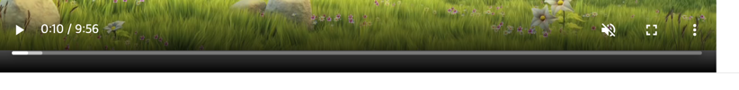

안녕하세요!

지난번에 소개해 드린 **react-player** 에 대한 포스팅이 블로그에서 가장 많은 페이지 뷰를 기록 했습니다!👍🏻  
그만큼 많은 분들이 사용하고 찾아보는 라이브러리 이겠죠..?!


이번 포스팅에서는 react-player에서 특정 시간만 영상 재생을 하는 기능에 대해 소개해 드리겠습니다.

-----

### 1. 개요
react-player에 대한 간단한 소개와 설치, 셋팅 방법은 [[React] react-player 소개 및 활용 (feat. onEnded)](https://shinsangeun.github.io/posts/react/react-player) 여기를 참고해 주세요!


#### 2. 샘플 코드
```
import ReactPlayer from 'react-player/lazy';

const Video = ({playList, index}) => {
    return (
        <>
            <h2>Player Test</h2>
            <div className='player-wrapper'>
                <ReactPlayer
                    className='react-player'
                    url={'https://commondatastorage.googleapis.com/gtv-videos-bucket/sample/BigBuckBunny.mp4'}    // 플레이어 url
                    width='800px'         // 플레이어 크기 (가로)
                    height='500px'        // 플레이어 크기 (세로)
                    playing={true}        // 자동 재생 on
                    muted={true}          // 자동 재생 on
                    controls={true}       // 플레이어 컨트롤 노출 여부
                    light={false}         // 플레이어 모드
                    pip={true}            // pip 모드 설정 여부
                    poster={'https://commondatastorage.googleapis.com/gtv-videos-bucket/sample/images/BigBuckBunny.jpg'}   // 플레이어 초기 포스터 사진
                    onEnded={() => handleVideo()}  // 플레이어 끝났을 때 이벤트
                />
            </div>
        </>
    )
}

export default Video;
```

- 자동 재생 설정을 하려면, playing과 muted를 **true**로 해야 autoplay 설정이 됩니다.
- 위의 코드를 로컬에서 실행하면 아래와 같은 화면이 나타납니다.




#### 3. 특정 구간 재생
플레이어의 특정 구간만 재생 할 수 있는 코드를 추가해 보겠습니다.
onDuration, getDuration 등 다양한 함수들이 있어서 테스트를 해보았는데 생각보다 간단한(?) 방법이 있었습니다 .

react-player github에 있는 [👉🏻이슈](https://github.com/CookPete/react-player/issues/433) 를 참고 하였고,
맨 하단에 있는 방법으로 추가하니 원하는 방향으로 정상 동작 하였습니다.

```
url={playerUrl + "#t=${startTime},${endTime}"}
```

url에 startTime과 endTime 파라미터를 추가해주면 됩니다.
적용한 코드는 아래와 같습니다.

```
import ReactPlayer from 'react-player/lazy';
import {useState, useRef} from "react";

type VideoPlayerProps = {
    title: string;
    vodPlaylistId: string;
}

const VideoPlayer = ({}: VideoPlayerProps) => {
    const [playIndex, setPlayIndex] = useState(0);
    const playerRef = useRef();

    const playList = [
        {index:1, url: 'https://commondatastorage.googleapis.com/gtv-videos-bucket/sample/BigBuckBunny.mp4'},
        {index:2, url: 'http://sample.vodobox.net/skate_phantom_flex_4k/skate_phantom_flex_4k.m3u8'},
        {index:3, url: 'http://playertest.longtailvideo.com/adaptive/wowzaid3/playlist.m3u8'}
    ];

    if(playList === null) return <p>Loading...</p>;

    return (
        <>
            <h2>Player Test</h2>
            <ReactPlayer
                // @ts-ignore
                ref={playerRef}
                // @ts-ignore
                url={playList[playIndex].url + "#t=3,10"}
                playing
                controls
                muted
                progressInterval={1000}
                pip={true}
                width={'800px'}
                height={'500px'}
            />
        </>
    )
}

export default VideoPlayer;
```

**"#t=3,10"** 을 추가함으로써 플레이어는 3초 지점에 영상이 재생되고 10초 지점에 영상이 멈추게 됩니다.  
영상이 재생 되고 10초 지점에 일시 정지 되는 모습 입니다.


초(seconds) 를 기준으로 동작 되어서 **"#t=72,100"** 로 설정하면 <U>1분 12초에 영상이 재생</U> 되고 <U>1분 40초에 영상이 정지</U> 됩니다.


### 4. 마치며
- 이렇게 간단하고 쉬운 옵션이 있는데.. 왜 github `ReadMe.md` 에는 어려운 onDuration(), getDuration() 함수만 있고 이런 자세한 내용이 안 쓰여져 있는 건지..!아쉽네요🧐
- 그래도 원하는 기능을 구현 할 수 있게 라이브러리가 잘 만들어져 있어서 아주 유용하게 쓸 수 있을 것 같아요🤘🏻

-----

오늘 준비한 내용은 여기까지 입니다.  
이번 포스팅이 도움이 되셨거나 궁금한 점이 있으시다면 언제든지 댓글을 달아주세요!🙋🏻‍♀️✨    


