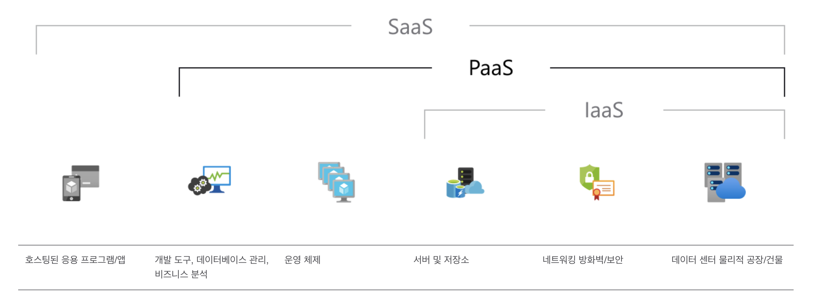

안녕하세요!

이번 포스팅 에서는 **Vercel**을 이용해서 Next.js 기반의 Github 프로젝트를 배포하는 방법에 대해 알아보도록 하겠습니다.


## 1. 개요
- 저번에 Heroku를 이용해서 Node.js로 만든 프로젝트를 배포하는 방법에 대해 알아봤었는데요.
- 이번엔 React 기반의 Next.js 를 이용해서 웹 사이트를 배포하는 방법에 대해 알려드리겠습니다.


## 2. Vercel 란?
- **헤로쿠(Heroku)** 란, 웹 애플리케이션 배치 모델로 사용되는 여러 프로그래밍 언어를 지원하는 `클라우드 PaaS` 입니다. Git과 Github등을 지원하고, 많은 서비스를 애드온과 API로 지원 합니다.
- 지원 하는 프로그래밍 언어
```
    1. Node.js
    2. Ruby
    3. Java
    4. PHP
    5. Python
    6. Go
    7. Scala
    8. Clojure
```
- 출처: [👉🏻나무 위키](https://namu.wiki/w/Heroku)

- 쉽게 말해서 **AWS**, **Netlify**와 같은 역할을 하는 무료 호스팅 서비스 클라우드 라고 생각하시면 됩니다. 물론, **AWS**는 <U>1년 동안만 무료로 사용</U>할 수 있고 **Netlify**와 **Heroku**는 <U>무료로 사용</U>할 수 있는 차이점이 있습니다.
- 저는 많은 유저가 사용하는 서비스가 아니고 배포 테스트 용도로 사용하다 보니, 무료 호스팅 서비스를 찾게 되었고 그 중에서 **Heroku**를 선택하게 되었습니다. 본인의 프로젝트와 사용 용도에 따라 적절한 사이트를 골라서 사용하시는 것이 좋을 것 같습니다!


### 3. Next.js 란?
- `PaaS(Platform as a Service)`는 단순한 클라우드 기반 앱에서 정교한 클라우드 사용에 이르기까지 <U>모든 것을 제공할 수 있는 리소스가 포함되어 있으며 클라우드에서 제공되는 완전한 개발 및 배포 환경</U>입니다.
- **PaaS**를 사용하면 소프트웨어 라이선스, 기본 애플리케이션 인프라 및 미들웨어, 컨테이너 오케스트레이터(ex. Kubernetes) 또는 <U>개발 도구와 기타 리소스를 구입하고 관리하는 비용과 복잡성이 없어집니다.</U> **사용자**는 <U>개발하는 응용 프로그램과 서비스를 관리</U>하고 **클라우드 서비스 공급자**는 <U>일반적으로 그 밖의 모든 항목을 관리</U>합니다.

<figure class="float-center" style="width: 240px">
  
  <figcaption>Early wooden printing press as depicted in 1568.</figcaption>
</figure>

- 출처: [👉🏻Microsoft azure](https://azure.microsoft.com/ko-kr/overview/what-is-paas/)


## 4. Vercel로 Github 프로젝트 배포하기
https://vercel.com/dashboard

4. 메일에 있는 링크로 접속한 후 작업을 시작 합니다.


## 5. Heroku 배포 확인
- 무료 사이트 이다보니 사용할 때 약간 delay가 있지만 가볍게 사용 하기에는 무리가 없어 보입니다. 개발자 포트폴리오나 가벼운 토이 프로젝트를 배포하기에 아주 유용하게 쓰일 듯 합니다.👍🏻


## 6. 마치며
- 배포를 성공 하자마자 바로 포스팅을 작성하게 되어 부족한 부분이 있을 수 있지만, 제가 만든 토이 프로젝트를 처음으로 사이트에 배포하게 되어 너무 뿌듯합니다.🤩
- 이 포스팅을 보고 **Heroku** 에서 여러분들의 포트폴리오나 토이 프로젝트를 배포에 성공 하셨으면 좋겠습니다!


오늘 준비한 내용은 여기까지 입니다.  
이번 포스팅이 도움이 되셨거나 궁금한 점이 있으시다면 언제든지 댓글을 달아주세요!👩🏻‍💻💕
