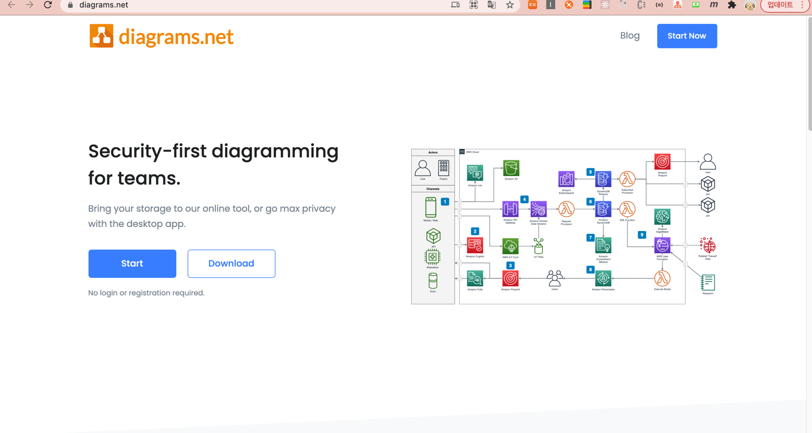
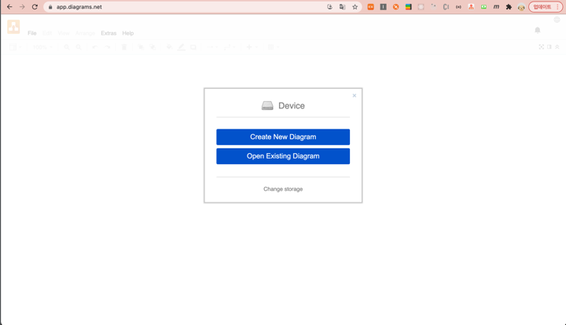
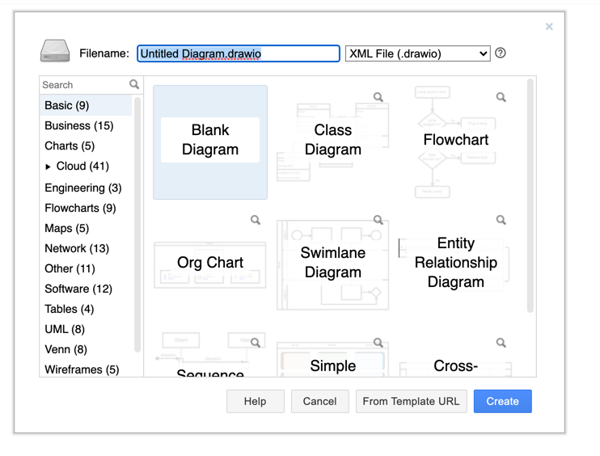
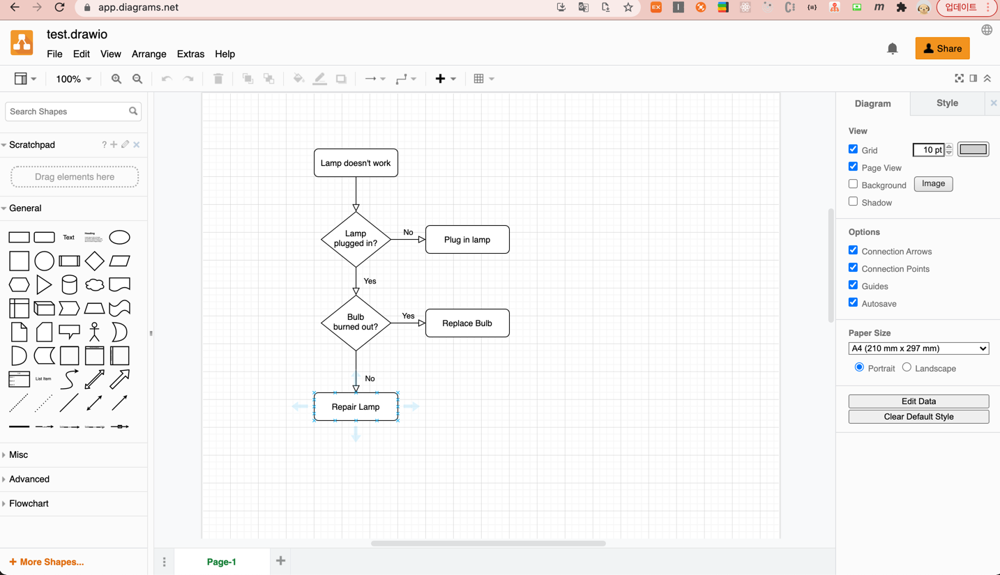
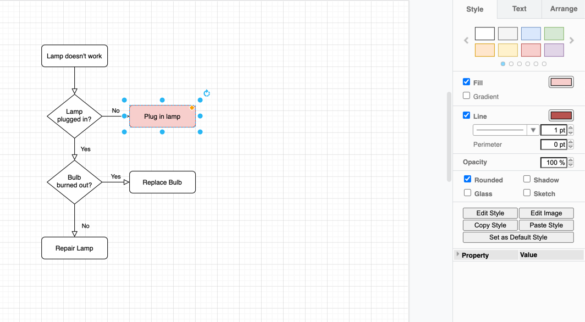
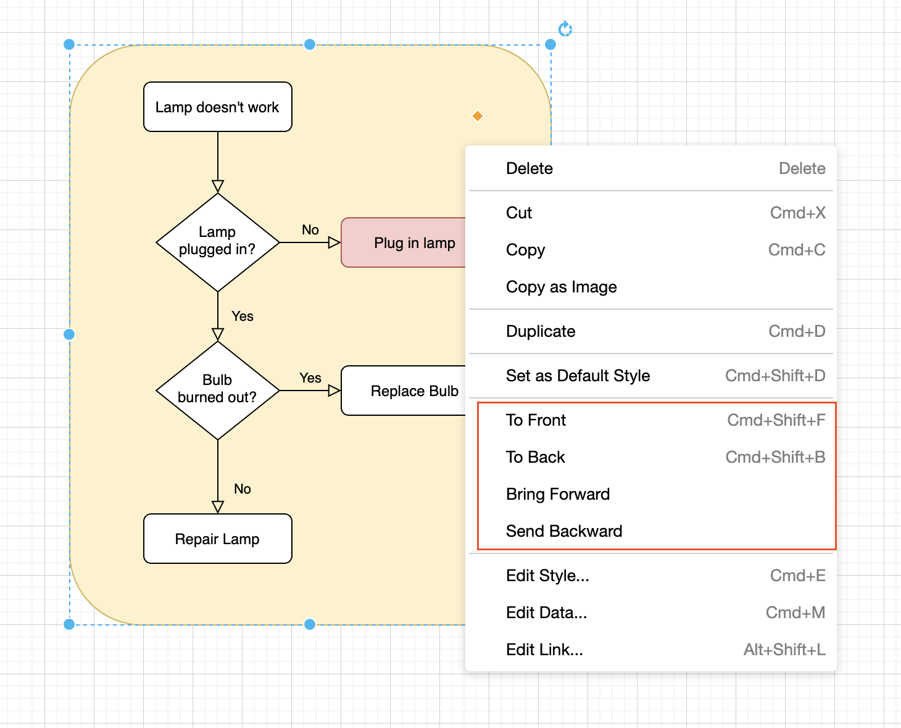

안녕하세요!

이번에 코드를 분석하며 **Flow Chart(순서도)** 를 그리는 업무를 맡게 되었는데,  
무료 다이어 그램 그리는 툴 중에 추천할 만한 툴을 여러분들과 공유해 보고자 합니다!🗣

### 1. Diagram 종류
- 다이어 그램을 배웠던 기억이 나는데 오랜만에 실무에서 사용하려니 갑자기 생각이 안나더라구요..(저만 그런가요?..🤐)   
- 그래서 여러가지 다이어 그램 종류를 아.주. 간단하게 정리 해 보았습니다. (이 포스팅은 툴을 소개 하는 글 이므로 자세한 설명과 그림은 구글링과 전공 서적을 참고해 주세요.🥲)

|        종류        |                                    설명                              | 
|:------------------:|:--------------------------------------------------------------------:|
|  Class Diagram     | 시스템의 구조적인 모습을 그림                                        | 
|  Sequence Diagram  | 객체들끼리 주고 받는 메세지의 순서를 시간의 흐름에 따라 분석한 그림  |
|  Use Case Diagram  | 요구 분석 과정에서 시스템과 외부와의 상호작용을 그림                 |
|    Flow Chart      | 명령의 순서를 보여주는 알고리즘 혹은 프로세스를 말함                 |
  

### 2. Draw.io 소개
- <U>Draw.io</U> 란 다이어그램을 그리기 위한 **무료 툴** 입니다. 
- `AWS`/ `Azure` 시스템 구성도를 그릴 수 있는 템플릿, `Map`, `Network` 등을 그릴 수 있는 기능이 많이 있어서 대학생이나 개발자, 기획자 분들도 이 툴이 유용할 것 같습니다.
- 요즘은 다이어 그램을 그릴 수 있는 `StarUML`, `IntelliJ`, `VSCode` 등 에서도 그릴 수 있는 기능이 있지만, 개발 툴이 아닌 환경에서 직접 그릴 때는 `draw.io` 를 이용해서 그리면 쉽고 간편하게 그릴 수 있다는 장점이 있습니다.
- 가장 마음에 들었던 점은 회원 가입, 로그인 없이 접속하면 바로 다이어그램을 그릴 수 있다는 점 입니다.

- 링크: [👉🏻무료 다이어 그램 툴 - digram.net](https://www.diagrams.net/)

### 3. 사용 방법
1.  [👉🏻다이어 그램 생성](https://app.diagrams.net/) 링크로 접속 하면 아래의 화면이 나타납니다.
- 새로운 다이어 그램을 그릴지, 기존의 다이어 그램을 오픈할 지 선택 합니다.
- 새로운 다이어 그램을 그리기 위해 위에 버튼을 선택 합니다.

 
    
    
2. 본인이 그릴 다이어그램을 선택하고 **Create** 버튼을 눌러 생성 합니다.
- ex) Class Diagram, Flowchart, Org Chart, Sequence Diagram...

 

3. 예시로 FlowChart를 생성 하였습니다. 필요한 기능에 맞게 도형을 추가하고 삭제할 수 있습니다.

- 도형을 선택하면 오른쪽 사이드 `Style` 탭에서 도형의 색상, 선, 스타일, 투명도 등을 지정 할 수 있습니다.

- 도형을 선택하고 오른쪽 마우스를 누르면 제어 메뉴가 나타납니다.
- `To Front`, `To Back`, `Bring Forward`, `Send Backward` 로 도형의 위치를 맨 앞/맨 뒤로 설정 할 수 있습니다.

  

- 웹에서는 영어 버전으로 나오지만 앱으로 다운받아서 사용 할 수도 있습니다.
    - 제가 사용 했을 때 Mac OS에서는 앱에서 한글 버전으로 나와서 쉽게 사용 할수 있었습니다.
    [👉🏻앱 다운로드 링크](https://github.com/jgraph/drawio-desktop/releases/tag/v14.6.13) 에서 본인의 OS와 버전에 맞는 것을 설치 하시면 됩니다!
    - 사용 하는 기능은 똑같이 사용 할 수 있고, 앱으로 했을 때 체감상 속도가 쫌 더 빠른 것 같다는 느낌을 받았습니다.

### 4. 후기
- 이제서야..우연히 알게 된 툴인데, 생각보다 사용하기도 쉽고 좋은 기능들이 많아서 앞으로도 종종 사용 할 예정입니다.
- **drawio-desktop** Github를 보니 `javascript` 기반으로 만들어 졌더라구요. 역시 좋은 언어라는 걸 한번 더 깨달았습니다.🤭
- 여러분들도 다이어그램을 그릴 때 써보시면 좋은 경험이 될 것 같아요. 완전 강추 입니다!👍🏻

-----

오늘 준비한 내용은 여기까지 입니다.   
이번 포스팅이 도움이 되셨거나 궁금한 점이 있으시다면 언제든지 댓글을 달아주세요!🙋🏻‍♀️✨

