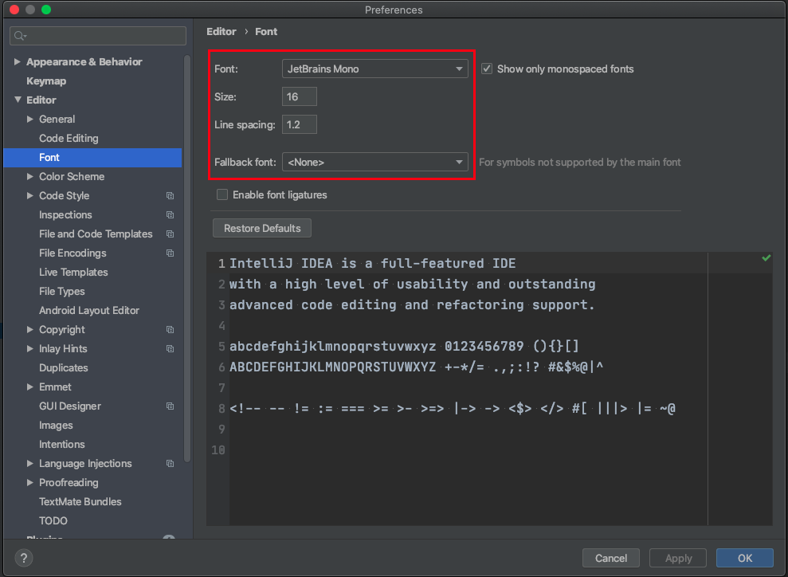
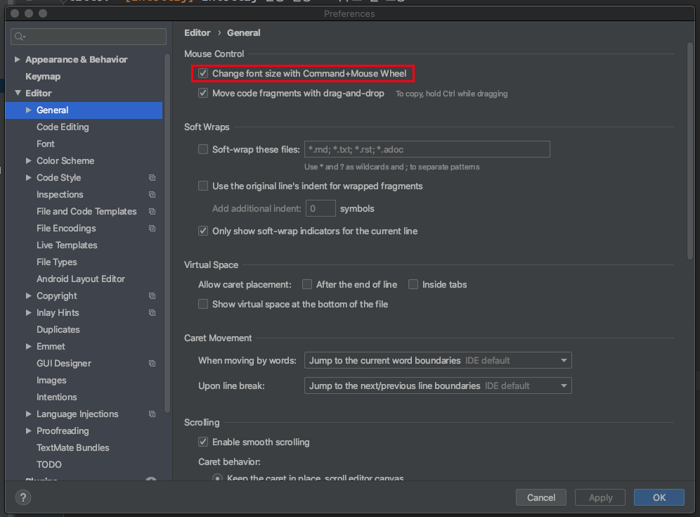
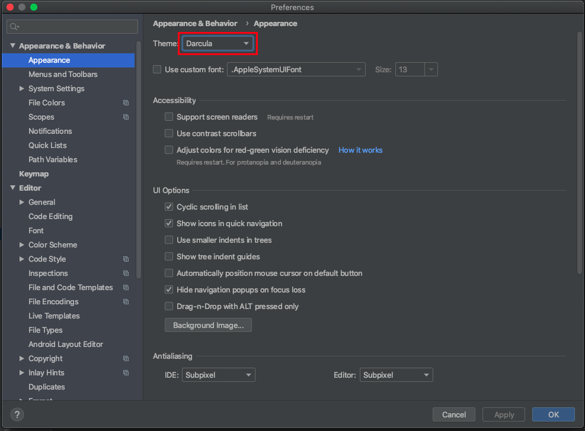
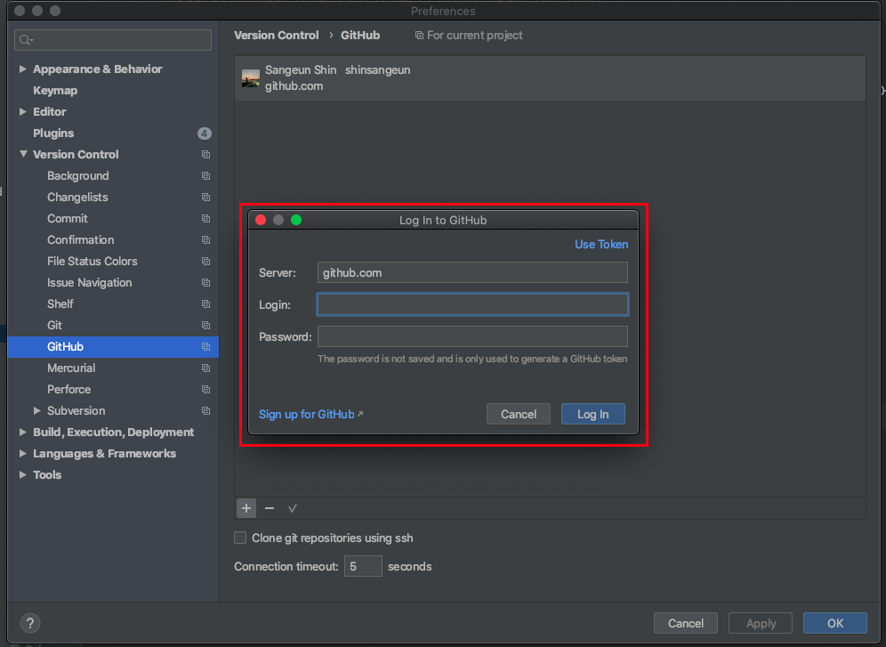
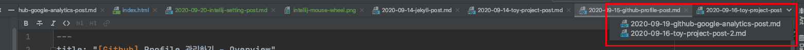
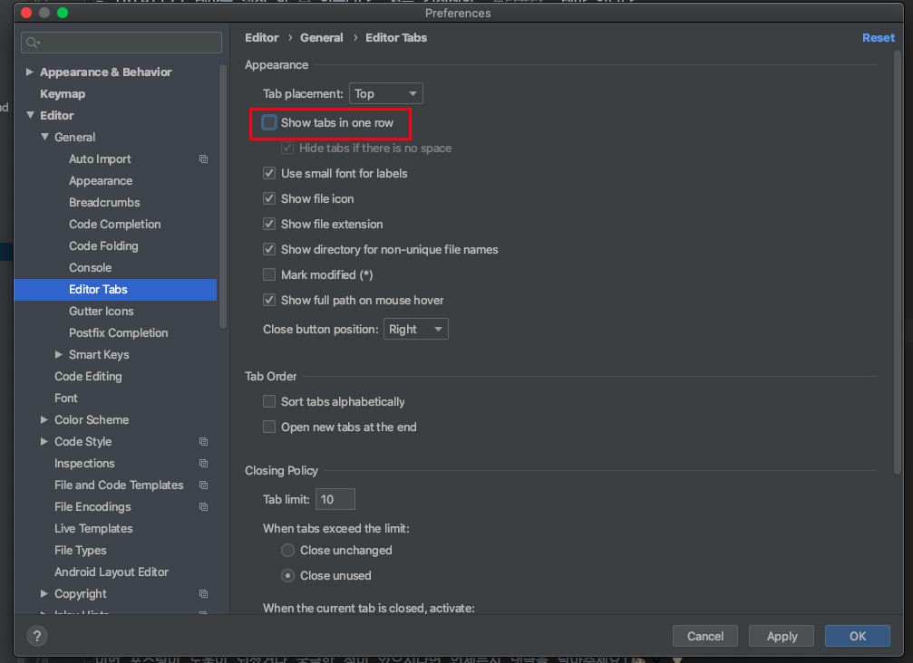
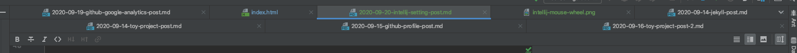

안녕하세요!

개발 할 때 `Intellij`를 주로 사용 하는데 환경 설정 방법을 간혹 까먹는 경우가 있습니다.  
그럴 때마다 매번 구글링 하기가 귀찮아서 이번 포스팅으로 환경 설정 방법을 정리 하고자 합니다.    
(개발 환경을 `Mac OS`으로 사용하기 때문에 `Windows` 환경과 다를 수 있습니다!)

-----

# 목차
[1. Font & Theme 설정 하기](#Font-&-Theme)  
[2. Github 설정 하기](#Github)  
[3. 창 여러개 Tab으로 띄우기](#Tab-설정)  
[4. 단축키 설정](#단축키-설정)

-----

### Font & Theme
- Intellij에서 환경을 설정하는 방법 입니다. (`Mac`에서 설정하는 방법 입니다.)

1. Intellij 폰트 설정
- 글씨 폰트와 글씨 크기, 자간 등을 설정 할수 있습니다.
- 메뉴: Preference > Appearance & Behavior > Appearance

2. 마우스 휠을 이용해서 폰트 크기를 조정
- `Control+마우스 휠`을 이용해서 폰트 크기를 조정 할 수 있도록 하는 셋팅 입니다. 초기 셋에는 마우스 휠이 체크가 되어 있지 않으므로 설정 해주어야 합니다.
- 메뉴: Preference > Editor > General

3. Intellij 테마 설정
- Intellij 테마를 설정 할 수 있습니다. 저는 검정색의 `드라큘라` 테마 입니다.
- 메뉴: Preference > Appearance & Behavior > Appearance

### Github
1. Github 연동하기
- Intellij에서 Github와 연동하는 방법 입니다. 아래 `+` 버튼을 눌러서 자신의 깃허브 계정으로 로그인 합니다.  
- 계정을 추가 하였으면 아래 `Apply` 버튼을 누르고 `OK` 버튼을 눌러서 저장 합니다.
- 메뉴: Preference > Version Control > Github

### Tab 설정
1. 창 여러개 Tab으로 띄우기
- Intellij에서 파일을 여러개 띄울 때 Tab으로 띄우는 방법입니다.  
- 파일을 여러개 띄우면 상단에 파일 이름이 hidden되어 나타납니다. 그러면 파일을 한번에 찾기가 어려워 집니다.
- 적용 전 모습

- 아래 체크 표시를 해제하면 창을 여러개 Tab으로 띄울수 있게 됩니다.
- 메뉴: Preference > Editor > General > Editor Tabs

- 적용 후 모습

### 단축키 설정 
- Mac 단축키 설정을 기반 으로 작성한 내용 입니다.

|        단축키         |              내용            |
|:-------------------:|:---------------------------:|
| command + opt + L   |           코드 자동 정렬        | 
|   Shift + Shift     |     프로젝트 내 파일 이름 검색     |
|   Shift + F         |          파일 내 검색          |
| command + Shift + F |        프로젝트 내 전체 검색     |
|   command + x       |            한 줄 삭제          |
|  control + opt + O  |     사용하지 않는 import 삭제    |

-----

오늘 준비한 내용은 여기까지 입니다.  
이번 포스팅이 도움이 되셨거나 궁금한 점이 있으시다면 언제든지 댓글을 달아주세요!🙋🏻‍♀️💡

