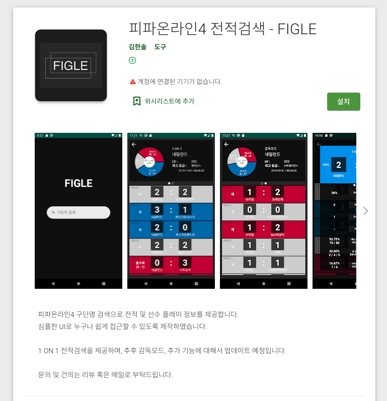

안녕하세요!

토이 프로젝트인 `FIGLE`을 진행하며 개발한 항목과 내용에 대해 기록 하고자 합니다.
  
-----

## 1. 주요 사항
1. 넥슨 개발자 센터의 FIFA Online API를 이용한다.  
- 링크: [개발자 센터](https://developers.nexon.com/fifaonline4/apiList)

2. React 기반의 전적검색 페이지를 만든다. (템플릿 사용)  
- 템플릿 출처:[https://www.creative-tim.com/product/argon-dashboard-react#](https://www.creative-tim.com/product/argon-dashboard-react#)

3. Github repository  
- 링크: [https://github.com/gksthf2271/FIGLE](https://github.com/gksthf2271/FIGLE)


## 2. 개발 요구 사항
- 유저의 아이디를 기반으로 유저의 매치 기록과 매치 상세 기록(승/패/무), 사용한 선수의 정보(선수 이미지, 팀, 선수 스탯)의 조회가 가능 하도록 한다.  
- 아래의 요구사항에 맞춰서 프로젝트를 개발한다. (페이지 하나당 포함될 내용)
```
1. 유저의 아이디를 검색한다.
2. 유저의 아이디로 매치 기록을 조회 한다.
3. 매치 기록의 상세 기록을 조회 한다.
4. 매치에서 사용한 선수의 기록을 조회 한다.
```

## 3. API 데이터
- React.js의 `axios`, `fetch` 함수를 이용해서 개발자 센터의 API의 데이터를 가져옵니다.  
  - 필요한 API (목록 이름은 개발자 센터의 API 이름 입니다.)
```
1. 유저 닉네임으로 유저 정보 조회
2. 유저 고유 식별자로 유저의 매치 기록 조회
3. 매치 상세 기록 조회
4. 선수 고유 식별자(spid) 메타데이터 조회
5. 선수 고유 식별자(spid)로 선수 이미지 조회 or 선수 식별자로(pid) 선수 이미지 조회
```

## 4. FIGLE 모바일 버전
- 모바일 버전으로 만들어진 `FIGLE` 앱을 참고하여 웹 버전도 완성 예정 입니다.


- 링크: [https://play.google.com/store/apps/details?id=com.khs.figle_m](https://play.google.com/store/apps/details?id=com.khs.figle_m)
- Github 링크: [https://github.com/gksthf2271/FIGLE_M](https://github.com/gksthf2271/FIGLE_M)


-----

오늘 준비한 내용은 여기까지 입니다.  
이번 포스팅이 도움이 되셨거나 궁금한 점이 있으시다면 언제든지 댓글을 달아주세요!👩🏻‍💻💕


