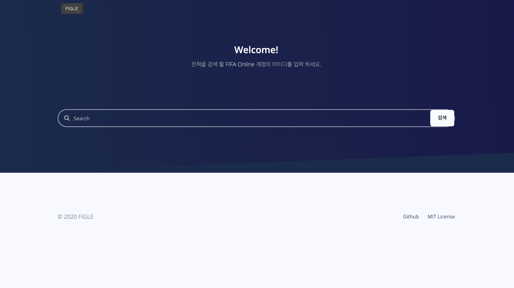
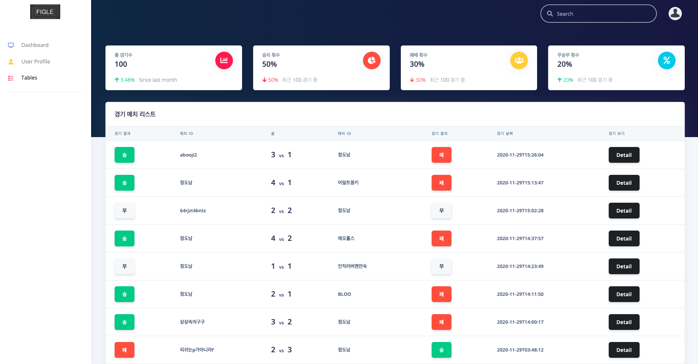
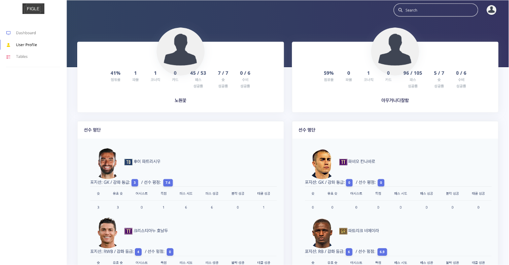

---
title: "[Project] FIGLE - 토이 프로젝트 완성"
date: "2020-11-11 15:34:24"
template: "post"
draft: false
slug: "figle-3"
category: "Project"
tags:
    - "Project"
    - "React"
    - "API"
    - "Toy-project"
description: "블로그를 시작하고 진행한 토이 프로젝트 `FIGLE`에 대한 포스팅을 작성 하였습니다."
--- 

안녕하세요!

블로그를 시작하고 진행한 토이 프로젝트 `FIGLE`에 대한 포스팅을 작성 하였습니다.  
11월을 마지막으로 `FIGLE`을 완성하게 되어 토이 프로젝트의 완성 글을 작성하게 되었습니다.

-----

### 1. FIGLE 관련 포스팅

👇🏻 궁금 하신 분들은 참고 해 주세요!
- [[Project] FIGLE - 토이 프로젝트의 시작](https://shinsangeun.github.io/categories/Project/figle-1)  
- [[Project] FIGLE - 개발 항목 정리(1)](https://shinsangeun.github.io/categories/Project/figle-2)

### 2. FIGLE Github
- Figle을 개발한 github 링크 입니다.
- 링크: [Github 👉🏻 FIGLE](https://github.com/gksthf2271/FIGLE)

### 3. FIGLE 스크린 샷
- Figle의 완성본 스크린 샷 입니다.  

1. 유저 아이디 검색  
- FIFA Online의 유저의 아이디를 검색하는 페이지 입니다.  
  

2. 유저 아이디 게임 목록 조회 
- 1번 페이지에서 검색한 해당 유저의 게임 목록을 조회 합니다. (100개 게임 조회)   

3. 게임 상세 내용 조회  
- 2번 페이지에서 검색된 게임 목록 중에서 원하는 게임의 `Detail` 버튼을 누르면 게임의 상세 내용이 조회 됩니다.
- 유저와 상대 유저의 `점유율/파울/코너킥/카드/패스 성공률/슛 성공률/수비 성공률`, 게임에 사용한 `선수 명단`에 대한 정보가 조회 됩니다.  

### 4. 프로젝트 완성 소감
- `React`로 도전한 첫 프로젝트라 그런지 처음에는 많이 두렵기도 하고 완성을 할지 막막 했지만, 다행히도 마무리를 하게 되어 뿌듯 하고 `React`에 대한 자신감이 생긴것 같습니다.
- `왜 진작 토이 프로젝트를 개발 하지 않았는지?` 에 대한 후회와 미련이 남긴 하지만 작은것 이라도 일단 개발을 해 보는 것이 중요 하다고 느끼게 되었습니다. 그래서 React를 이용해서 새로운 토이 프로젝트를 하나 더 만들어 볼 생각 입니다.
- 앞으로 새로운 토이 프로젝트도 기대 많이 해 주시고 제가 잘 해내고 있는지 지켜봐 주세요!😆🔥

-----

오늘 준비한 내용은 여기까지 입니다.  
이번 포스팅이 도움이 되셨거나 궁금한 점이 있으시다면 언제든지 댓글을 달아주세요!🙋🏻‍♀️✨  

